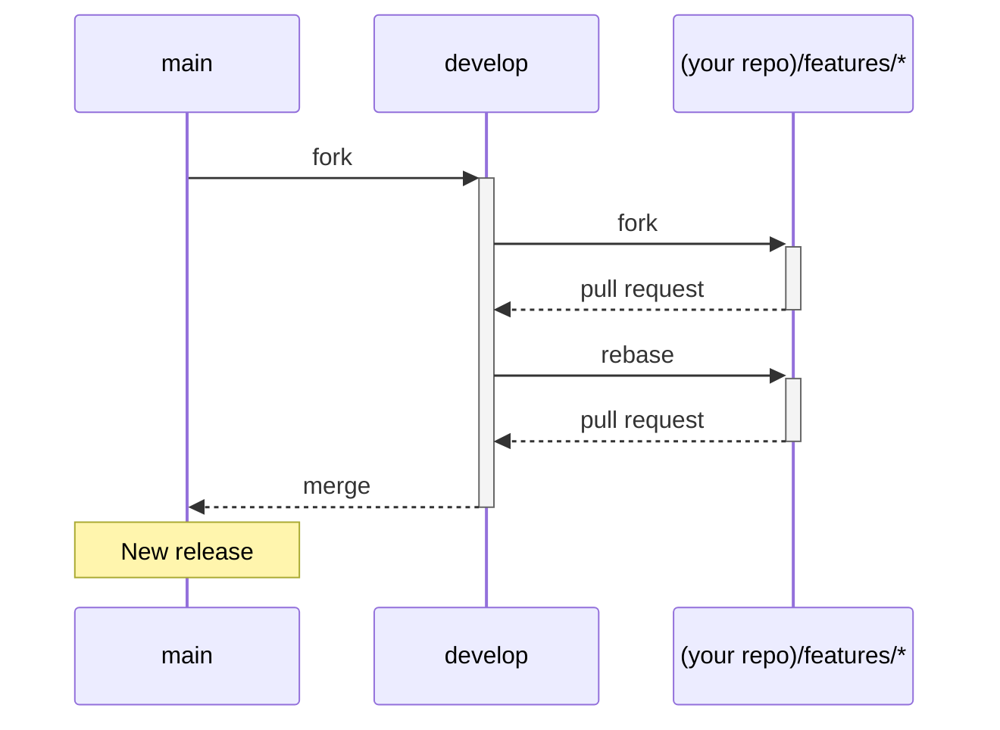

# このプロジェクトへの参加について

このプロジェクトのために時間を割いていただき、ありがとうございます。どんな形の協力でも感謝致します。

もしプログラムを改善するためのアイディアや新しいコードをお持ちでしたら、このファイルの説明に従ってお願い致します。

## アイディアの提案、不具合報告

まずは似たような提案や不具合報告が既に協議されていないかを[issueページ](https://github.com/digital-go-jp/abr-geocoder/issues?q=)から探してみてください。もしかしたらヒントが見つかるかもしれません。

それでも見つからない場合は、[issueページ](https://github.com/digital-go-jp/abr-geocoder/issues)の[New issue]ボタンから投稿してください。

# コードのコントリビューション

不具合を改善するため、新しい機能を導入するためにコードやファイルをPull Requestでお送り頂く場合、まずそれが必要なのかどうかを[issueページ](https://github.com/digital-go-jp/abr-geocoder/issues)で提案して議論をしてください。

すでに類似の議論をしている場合は、あなたがPull Requestのために作業をする時間を抑えることが出来ます。

事前に議論なくPull Requestをお送りいただくと、そこから議論が始まるので、受け入れるまでに時間がかかります。

## git flow

このリポジトリでは、`Git flow`開発スタイルを採用しており、各ブランチごとに役割が異なります。

- main
  リリース版のコードを配置。`version x.x.x`のようにタグ付けを行う。
  ※このブランチ上での作業は行わない

- develop
  現在開発中の次期バージョンのコードを配置。
  ※このブランチ上での作業は行わない

- features/issue_**
  developから分岐し、developにマージする。
  Pull Requestを行うためのコードを配置します。

## 開発フロー

Pull Requestを作成する際には、リポジトリをforkした後に、developブランチから`features/issue_xx`というブランチを作ってコードを書いてください。

