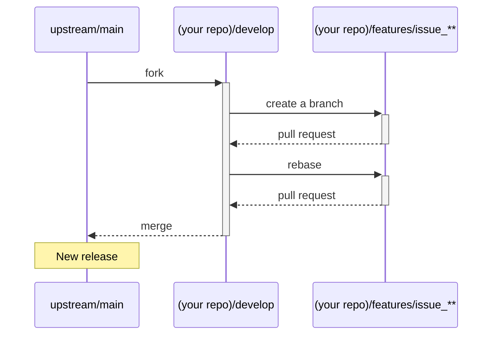

# このプロジェクトへの参加について

このプロジェクトのために時間を割いていただき、ありがとうございます。どんな形の協力でも感謝致します。

もしプログラムを改善するためのアイディアや新しいコードをお持ちでしたら、このファイルの説明に従ってお願い致します。

## アイディアの提案、不具合報告

まずは似たような提案や不具合報告が既に協議されていないかを[issueページ](https://github.com/digital-go-jp/abr-geocoder/issues?q=)から探してみてください。もしかしたらヒントが見つかるかもしれません。

それでも見つからない場合は、[issueページ](https://github.com/digital-go-jp/abr-geocoder/issues)の[New issue]ボタンから投稿してください。

# コードのコントリビューション

不具合を改善するため、新しい機能を導入するためにコードやファイルをPull Requestでお送り頂く場合、まずそれが必要なのかどうかを[issueページ](https://github.com/digital-go-jp/abr-geocoder/issues)で提案して議論をしてください。

すでに類似の議論をしている場合は、あなたがPull Requestのために作業をする時間を抑えることが出来ます。

事前に議論なくPull Requestをお送りいただくと、そこから議論が始まるので、受け入れるまでに時間がかかります。

## git flow

このリポジトリでは、`Git flow`開発スタイルを採用しており、各ブランチごとに役割が異なります。

- `main`
  リリース版のコードを配置。version x.x.xのようにタグ付けを行う。
  ※このブランチ上での作業は行わない

- `develop`
  現在開発中の次期バージョンのコードを配置。
  ※このブランチ上での作業は行わない

- `features/issue_**`
  developから分岐し、developにマージする。
  Pull Requestを行うためのコードを配置します。

## 開発フロー

Pull Requestを作成する際の手順を示します。



### :one: fork元のリポジトリをupstreamとして設定します

Github画面上でリポジトリをForkします。
```
$ git remote -v
> origin  https://github.com/YOUR_USERNAME/abr-geocoder.git (fetch)
> origin  https://github.com/YOUR_USERNAME/abr-geocoder.git (push)

$ git remote add upstream https://github.com/digital-go-jp/abr-geocoder.git

$ git remote -v
> origin    https://github.com/YOUR_USERNAME/abr-geocoder.git (fetch)
> origin    https://github.com/YOUR_USERNAME/abr-geocoder.git (push)
> upstream  https://github.com/digital-go-jp/abr-geocoder.git (fetch)
> upstream  https://github.com/digital-go-jp/abr-geocoder.git (push)
```


### :two: `develop`ブランチの取り込み

Forkしたリポジトリには`developブランチが含まれていないので`取り込みます。

```
$ git branch
> * main

$git fetch upstream
> remote: Enumerating objects: 28, done.
> remote: Counting objects: 100% (15/15), done.
> remote: Compressing objects: 100% (3/3), done.
> remote: Total 28 (delta 12), reused 15 (delta 12), pack-reused 13
> Unpacking objects: 100% (28/28), 5.68 KiB | 118.00 KiB/s, done.
> From https://github.com/digital-go-jp/abr-geocoder
>  * [new branch]      develop    -> upstream/develop
>  * [new branch]      main       -> upstream/main

$ git checkout -b develop upstream/develop
> branch 'develop' set up to track 'upstream/develop'.
> Switched to a new branch 'develop'

$ git branch
> * develop
>   main
```


### :three: `features/issue_**` ブランチの作成

`develop`ブランチから、issue用のブランチを作ります。
このブランチ上でコードを変更する作業を行ってください。
`**`の部分は、issue番号に置き換えます。

```
$ git switch -c features/issue_1
> Switched to a new branch 'features/issue_**'

$ git branch
>   develop
> * features/issue_**
>   main
```

### :four: upstream/developに同期する

コードの変更に時間を要する場合、ローカルのgitリポジトリのコードと、upstreamリポジトリのコードに差が出るかもしれません。
Pull requestを送る前に、rebaseをすることで、ローカルのgitリポジトリのコードを、upstreamのコードに同期させます。

```
$ git rebase upstream/develop
```

### :five: Pull Requestを送る

Github画面上でPull Requestを作成します。
**通常は `develop` ブランチ宛にPull Requestを作成してください。**

説明欄には、以下の情報を含んでください。
- 関連するissue
- Pull Requestの概要説明
- コードレビューをしてもらいたい内容
- コードレビューをしてもらうために必要な情報 (再現手順など)

良いPull Requestの書き方は、[外部記事:みんなが幸せになれるPullRequestの作り方を考えてみた](https://qiita.com/marumaru0113/items/c53db580b812f8f6d4da) を参考にしてください。


