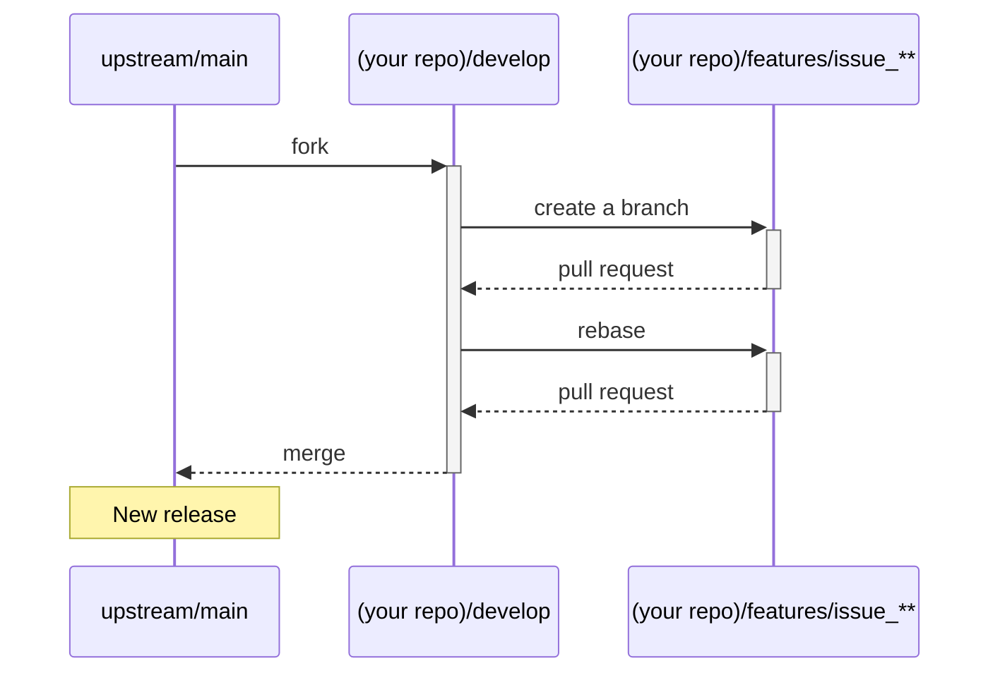

# Contributing to abr-geocoder

We would be delighted if you would contribute to abr-geocoder and help make it even better than it is today. We appreciate your help!

As a contributor, please follow our guidelines before submitting a pull request.

## Have a new idea, or found an issue?

Please search the [issue page](https://github.com/digital-go-jp/abr-geocoder/issues?q=)  for similar issue reports or ideas that we have already discussed. You may find similar subjects or bug reports that have already been discussed.

If you cannot find anything relevant, please post a new issue by clicking the [New issue] button in the [issue page](https://github.com/digital-go-jp/abr-geocoder/issues).

# Creating a pull request

If you would like to submit a pull request to improve or fix a problem, please create a discussion on the [issue page](https://github.com/digital-go-jp/abr-geocoder/issues) first. This is even important for hot fixes.

If there are already similar disucssions, you can join them. This can help you save time when preparing your pull request.

Submitting a pull request without prior discussion may lead to further discussions, which could delay the acceptance process.


## git flow

In this repository, we use the `Git flow` development style, which defines a set of branches with specific purposes.

- `main`
  The `main` branch contains the code for the released version. It is tagged with a version number, such as "version x.x.x".
  
- `develop`
  The `develop` branch contains the code for the upcoming version. This is where new features and bug fixes are developed.

- `features/issue_**`
  The `features/issue_**` branches are used to develop new features. These branches are forked from the `develop` branch and merged back into the `develop` when the feature is complete.

## Development flow

Here are the steps you can follow to create a pull request:



### :one: Setting this repository as the `upstream`

Fork this repository from Github, then run the following commands:

```
$ git remote -v
> origin  https://github.com/YOUR_USERNAME/abr-geocoder.git (fetch)
> origin  https://github.com/YOUR_USERNAME/abr-geocoder.git (push)

$ git remote add upstream https://github.com/digital-go-jp/abr-geocoder.git

$ git remote -v
> origin    https://github.com/YOUR_USERNAME/abr-geocoder.git (fetch)
> origin    https://github.com/YOUR_USERNAME/abr-geocoder.git (push)
> upstream  https://github.com/digital-go-jp/abr-geocoder.git (fetch)
> upstream  https://github.com/digital-go-jp/abr-geocoder.git (push)
```


### :two: Syncing the `develop` from the `upstream`.

The forked repository (your repository) does not have the `develop` branch, so you need to import it from the `upstream`.

```
$ git branch
> * main

$git fetch upstream
> remote: Enumerating objects: 28, done.
> remote: Counting objects: 100% (15/15), done.
> remote: Compressing objects: 100% (3/3), done.
> remote: Total 28 (delta 12), reused 15 (delta 12), pack-reused 13
> Unpacking objects: 100% (28/28), 5.68 KiB | 118.00 KiB/s, done.
> From https://github.com/digital-go-jp/abr-geocoder
>  * [new branch]      develop    -> upstream/develop
>  * [new branch]      main       -> upstream/main

$ git checkout -b develop upstream/develop
> branch 'develop' set up to track 'upstream/develop'.
> Switched to a new branch 'develop'

$ git branch
> * develop
>   main
```


### :three: Creating a `features/issue_**`

Forks a branch named `features/issue_**` from the `develop` branch to work on your issue ticket.
Replace `**` with the issue number.

```
$ git switch -c features/issue_1
> Switched to a new branch 'features/issue_**'

$ git branch
>   develop
> * features/issue_**
>   main
```

### :four: Rebasing to `upstream/develop`

If you take a long time to make your pull request,
the code in your local repository may diverge from the code in the upstream repository.

To ensure that your pull request is compatible with the upstream code, please rebase your local repository before submitting the pull request.

```
$ git rebase upstream/develop
```

### :five: Submitting your pull request 

You can submit a pull request from your `features/issue_**` branch to the `upstream/develop` branch.

Please include the following information in your pull request:
- A link to the related issue
- A brief descrption of your pull request, including how your code works.
- Any specific areas that you would like us to review.
- Any screenshorts or other supporting documentation.

Please read the [(Github blog) How to write the perfect pull request](https://github.blog/2015-01-21-how-to-write-the-perfect-pull-request/)

