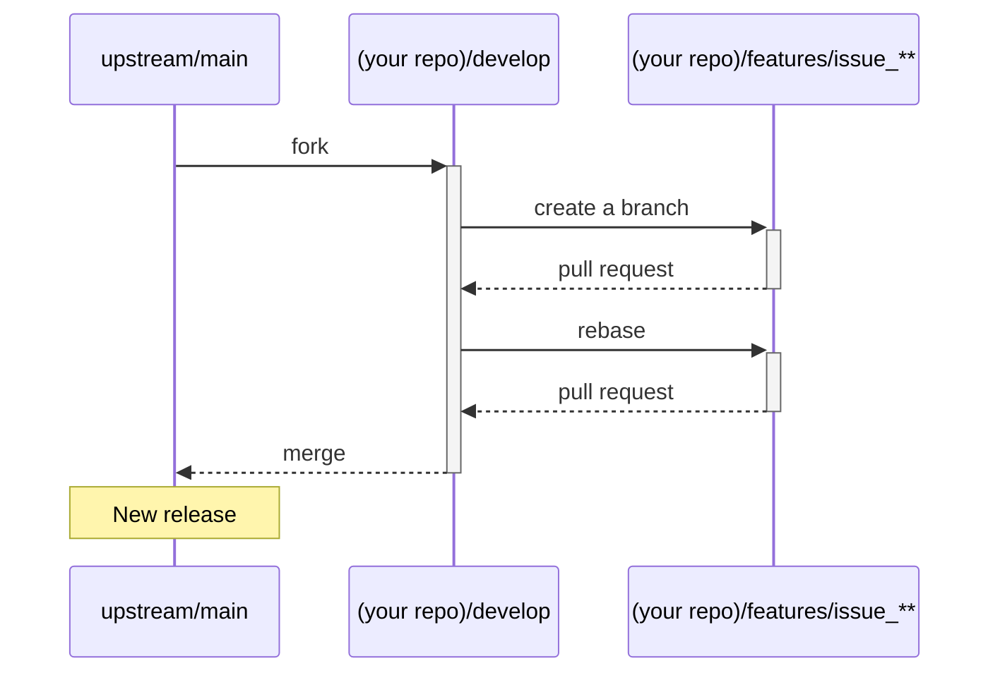

# Contributing to this project

We would love for you to contribute to abr-geocoder and help make it even better than it is today! We are really appreciate for your big help! 

As a contributor, we would like you to follow our guidelines before making a pull request.

## Have a new idea, or found an issue?

We would like you to search similar issue reports or similar ideas, we have already discussed, in the [issue](https://github.com/digital-go-jp/abr-geocoder/issues?q=). You could be find out similar subjects or bug reports that have already been discussed.

Even if you can't find anything relavant, please post a new issue by clicking the [New issue] button in the [issue page](https://github.com/digital-go-jp/abr-geocoder/issues).

# Creating a pull request

If you would like to submit a pull request to improve or fix a problem, we would ask you to make a discussion on the [issueページ](https://github.com/digital-go-jp/abr-geocoder/issues) page even it's a hot fix.

If there are already similar discussions, you can join them, and it can help save your time in preparing your Pull Request.

Submitting your Pull Request without prior discussion may lead to further discussions, which could take longer time for the acceptance process.

## git flow

In this repository, we adopt the `Git flow` development style, which each branch has a different purpose.

- `main`
  We place the code for the release version, and tag it with a format such as "version x.x.x".
  
- `develop`
  We place the code for the upcomming version under development.

- `features/issue_**`
  Forks a branch from the `develop` branch and make the necessary changes. Once we have completed the changes, we create a Pull Request to merge the code back into the 'develop' branch.

## Development flow

Here are the steps to follow when creating a Pull Request.



### :one: Sets this repository as the `upstream`

Forks this repository from the github, then runs the following statements:

```
$ git remote -v
> origin  https://github.com/YOUR_USERNAME/abr-geocoder.git (fetch)
> origin  https://github.com/YOUR_USERNAME/abr-geocoder.git (push)

$ git remote add upstream https://github.com/digital-go-jp/abr-geocoder.git

$ git remote -v
> origin    https://github.com/YOUR_USERNAME/abr-geocoder.git (fetch)
> origin    https://github.com/YOUR_USERNAME/abr-geocoder.git (push)
> upstream  https://github.com/digital-go-jp/abr-geocoder.git (fetch)
> upstream  https://github.com/digital-go-jp/abr-geocoder.git (push)
```


### :two: Synchronizes the `develop` from the `upstream`.

Sinc the forked repository (your repository) does not have the `develop` branch, imports it from the `upstream`.

```
$ git branch
> * main

$git fetch upstream
> remote: Enumerating objects: 28, done.
> remote: Counting objects: 100% (15/15), done.
> remote: Compressing objects: 100% (3/3), done.
> remote: Total 28 (delta 12), reused 15 (delta 12), pack-reused 13
> Unpacking objects: 100% (28/28), 5.68 KiB | 118.00 KiB/s, done.
> From https://github.com/digital-go-jp/abr-geocoder
>  * [new branch]      develop    -> upstream/develop
>  * [new branch]      main       -> upstream/main

$ git checkout -b develop upstream/develop
> branch 'develop' set up to track 'upstream/develop'.
> Switched to a new branch 'develop'

$ git branch
> * develop
>   main
```


### :three: Creates a `features/issue_**`

Forks a branch named `features/issue_**` from the `develop` branch for working your issue ticket.
Please replaces `**` with the issue number.

```
$ git switch -c features/issue_1
> Switched to a new branch 'features/issue_**'

$ git branch
>   develop
> * features/issue_**
>   main
```

### :four: Rebase to `upstream/develop`

If you take longer time to make your pull requrst,
there may be a difference between the code in the local git repository and the code in the upstream repository.

Before sending a pull request, we would like you to rebase the code in your local git repository to synchorize it with the code in the upstream repository.

```
$ git rebase upstream/develop
```

### :five: Submitting your Pull Request 

You can make a pull request from your `features/issue_**` branch to the `upstream/develop` branch.

Please include the breif descriptions below:
- Related issue link
- Brief description of your pull request
  - how does work your code, etc.
- What you would like us to do code review on.
- Screenshots, etc

Please refer the [(Github blog) How to write the perfect pull request](https://github.blog/2015-01-21-how-to-write-the-perfect-pull-request/)

