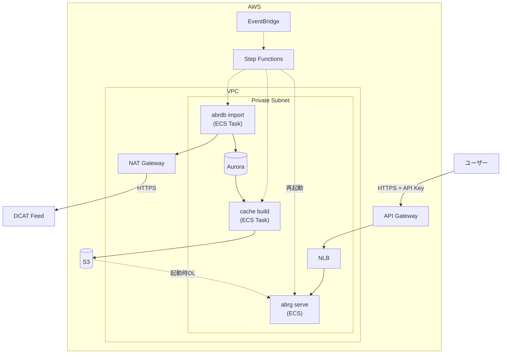
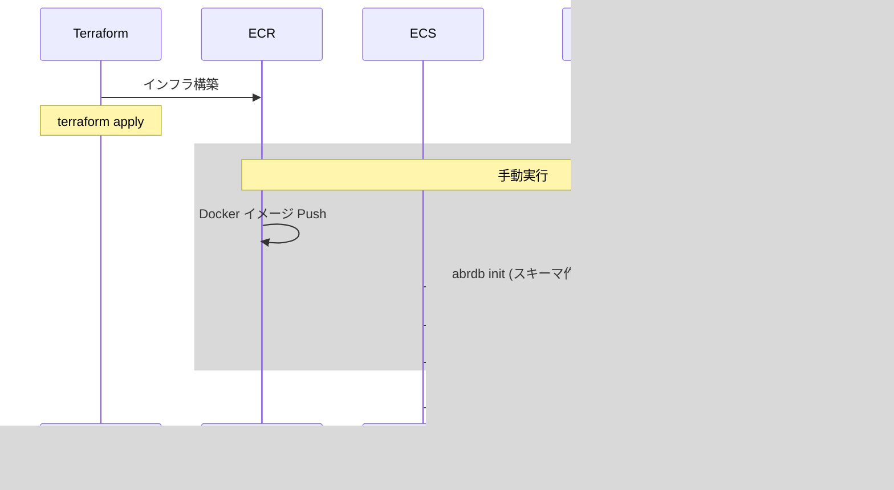
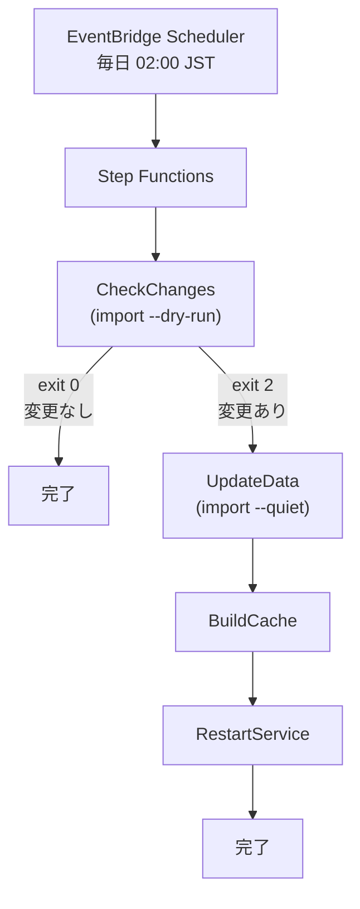

# AWS デプロイガイド

ABR Geocoder を AWS 環境で運用するための構成と運用手順です。

## アーキテクチャ



## Terraform 構成

```
terraform/
├── bootstrap/        # tfstate backend (S3 + DynamoDB)
├── modules/
│   ├── network/      # VPC, Subnet, NAT, Security Groups
│   ├── database/     # Aurora PostgreSQL
│   ├── storage/      # S3, ECR
│   ├── ecs/          # ECS Cluster, Task, Service, NLB
│   ├── api_gateway/  # API Gateway REST API, VPC Link, API Key
│   └── workflow/     # Step Functions, EventBridge (日次更新自動化)
├── main.tf           # 環境定義
└── README.md
```

## デプロイ手順

### 前提条件

- Terraform >= 1.0
- AWS CLI 設定済み
- 適切な IAM 権限

以降のコマンドは以下を前提とします:

```bash
export AWS_REGION=ap-northeast-1
```

### CloudWatch Logs role 未設定のアカウントのみ

```bash
aws apigateway get-account --query cloudwatchRoleArn --output text
```

出力が `None` なら、API Gateway が CloudWatch Logs にログを出力するために以下を実行（アカウント全体で1度だけ）。

```bash
# Trust policy
cat > /tmp/apigw-trust.json <<'EOF'
{"Version":"2012-10-17","Statement":[{"Effect":"Allow","Principal":{"Service":"apigateway.amazonaws.com"},"Action":"sts:AssumeRole"}]}
EOF

# Create role + attach policy
ROLE_ARN=$(aws iam create-role \
  --role-name apigw-cloudwatch \
  --assume-role-policy-document file:///tmp/apigw-trust.json \
  --query 'Role.Arn' --output text)

aws iam attach-role-policy \
  --role-name apigw-cloudwatch \
  --policy-arn arn:aws:iam::aws:policy/service-role/AmazonAPIGatewayPushToCloudWatchLogs

# Register to API Gateway account setting
aws apigateway update-account \
  --patch-operations op=replace,path=/cloudwatchRoleArn,value=$ROLE_ARN
```

### Bootstrap（初回のみ）

```bash
cd docs/aws/terraform/bootstrap
terraform init
terraform apply
```

S3 バケット `abrg-tfstate-${ACCOUNT_ID}` と DynamoDB `abrg-terraform-lock` を作成します。

### 環境構築

```bash
cd docs/aws/terraform
terraform init \
  -backend-config="bucket=abrg-tfstate-$(aws sts get-caller-identity --query Account --output text)" \
  -backend-config="dynamodb_table=abrg-terraform-lock" \
  -backend-config="region=ap-northeast-1"
terraform apply
```

## 初回構築

### データフロー



### 環境変数の設定

```bash
cd docs/aws/terraform

# Terraform output から環境変数を設定
export ECR_REGISTRY=$(terraform output -raw abrg_repository_url | cut -d/ -f1)
export ABRG_REPO=$(terraform output -raw abrg_repository_url)
export ABRDB_REPO=$(terraform output -raw abrdb_repository_url)
export ECS_CLUSTER=$(terraform output -raw ecs_cluster_name)
export PRIVATE_SUBNETS=$(terraform output -json private_subnet_ids | jq -r 'join(",")')
export ECS_SG=$(terraform output -raw ecs_security_group_id)
export API_ENDPOINT=$(terraform output -raw api_gateway_endpoint)
export API_KEY=$(terraform output -raw api_key_value)
```

### Docker イメージのビルド・プッシュ

```bash
# プロジェクトルートに移動
cd /path/to/abr-geocoder

# ECR ログイン
aws ecr get-login-password | \
  docker login --username AWS --password-stdin $ECR_REGISTRY

# abrg (Graviton ARM64, AWS CLI 付きイメージ)
docker build --platform linux/arm64 -f docs/aws/abrg.Dockerfile -t abrg .
docker tag abrg:latest $ABRG_REPO:latest
docker push $ABRG_REPO:latest

# abrdb
docker build --platform linux/arm64 -f abrdb/Dockerfile -t abrdb .
docker tag abrdb:latest $ABRDB_REPO:latest
docker push $ABRDB_REPO:latest
```

### データベース初期化

```bash
# PRIVATE_SUBNETS をJSON配列形式に変換
SUBNET_JSON=$(echo $PRIVATE_SUBNETS | jq -R 'split(",")' -c)

aws ecs run-task \
  --cluster $ECS_CLUSTER \
  --task-definition abrdb-import \
  --launch-type FARGATE \
  --overrides '{
    "containerOverrides": [{
      "name": "abrdb",
      "command": ["init"]
    }]
  }' \
  --network-configuration "{
    \"awsvpcConfiguration\": {
      \"subnets\": $SUBNET_JSON,
      \"securityGroups\": [\"$ECS_SG\"],
      \"assignPublicIp\": \"DISABLED\"
    }
  }"
```

### 初回インポート（フルインポート）

初回インポートはタスク定義のデフォルトスペック（16 vCPU / 32 GB）で実行します。

```bash
aws ecs run-task \
  --cluster $ECS_CLUSTER \
  --task-definition abrdb-import \
  --launch-type FARGATE \
  --network-configuration "{
    \"awsvpcConfiguration\": {
      \"subnets\": $SUBNET_JSON,
      \"securityGroups\": [\"$ECS_SG\"],
      \"assignPublicIp\": \"DISABLED\"
    }
  }"
```

### キャッシュビルド

```bash
aws ecs run-task \
  --cluster $ECS_CLUSTER \
  --task-definition abrg-cache-build \
  --launch-type FARGATE \
  --network-configuration "{
    \"awsvpcConfiguration\": {
      \"subnets\": $SUBNET_JSON,
      \"securityGroups\": [\"$ECS_SG\"],
      \"assignPublicIp\": \"DISABLED\"
    }
  }"
```

### サービス再起動

キャッシュビルド完了後、abrg サービスを再起動して新しいキャッシュを読み込みます。

```bash
aws ecs update-service --cluster $ECS_CLUSTER --service abrg-service --force-new-deployment
```

> **Note**: terraform apply 時点で abrg サービスは起動しますが、キャッシュが存在しないため S3 アクセスエラーになります。キャッシュビルド完了後に再起動が必要です。

### 動作確認

```bash
curl -s -H "X-API-Key: $API_KEY" --get \
  --data-urlencode "address=東京都千代田区紀尾井町1-3" \
  "$API_ENDPOINT/geocode" | jq '.features[0]'
```

## 運用

### API アクセス

```bash
# 環境変数設定（docs/aws/terraform で実行）
export API_ENDPOINT=$(terraform output -raw api_gateway_endpoint)
export API_KEY=$(terraform output -raw api_key_value)

# ヘルスチェック
curl -H "X-API-Key: $API_KEY" "$API_ENDPOINT/health"

# ジオコーディング
curl -H "X-API-Key: $API_KEY" --get \
  --data-urlencode "address=東京都千代田区紀尾井町1-3" \
  "$API_ENDPOINT/geocode"
```

### データ更新ワークフロー

EventBridge Scheduler が毎日 02:00 JST に Step Functions を実行します。



1. **CheckChanges** (`import --dry-run`) — DCAT Feed と差分検出
2. **UpdateData** (`import --quiet`) — 差分インポート
3. **BuildCache** — DuckDB キャッシュ再構築
4. **RestartService** — ECS サービス再起動

### 手動トリガー

```bash
aws stepfunctions start-execution \
  --state-machine-arn arn:aws:states:ap-northeast-1:ACCOUNT_ID:stateMachine:abrg-data-update
```

### ログ確認

```bash
# リアルタイムログ
aws logs tail /ecs/abrg/abrg --follow

# エラーログのみ
aws logs filter-log-events \
  --log-group-name /ecs/abrg/abrg \
  --filter-pattern "ERROR"
```

### イメージ更新

[初回構築 > Docker イメージのビルド・プッシュ](#docker-イメージのビルド・プッシュ)の手順でイメージを更新後、タスク定義の更新とサービスの再起動を行います。

```bash
cd docs/aws/terraform
terraform apply

aws ecs update-service --cluster $ECS_CLUSTER --service abrg-service --force-new-deployment
```

### ロールバック

```bash
# S3 バージョン一覧確認
aws s3api list-object-versions --bucket $(terraform output -raw cache_bucket) --prefix abrg/abrg.duckdb.gz

# 特定バージョンを復元
aws s3api copy-object \
  --bucket $(terraform output -raw cache_bucket) \
  --copy-source "$(terraform output -raw cache_bucket)/abrg/abrg.duckdb.gz?versionId=xxx" \
  --key abrg/abrg.duckdb.gz

# サービス再起動
aws ecs update-service --cluster $ECS_CLUSTER --service abrg-service --force-new-deployment
```

### リソース削除

```bash
cd docs/aws/terraform
terraform destroy
```
