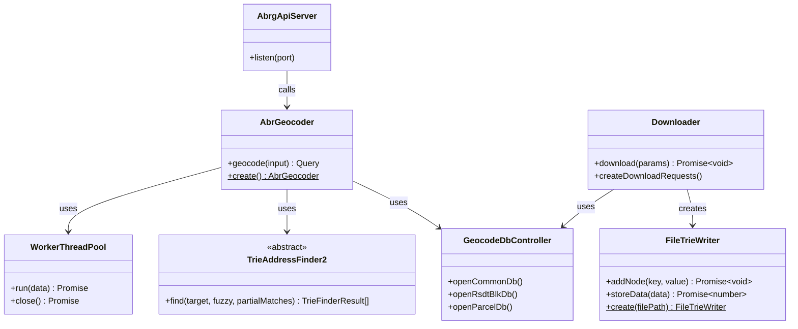
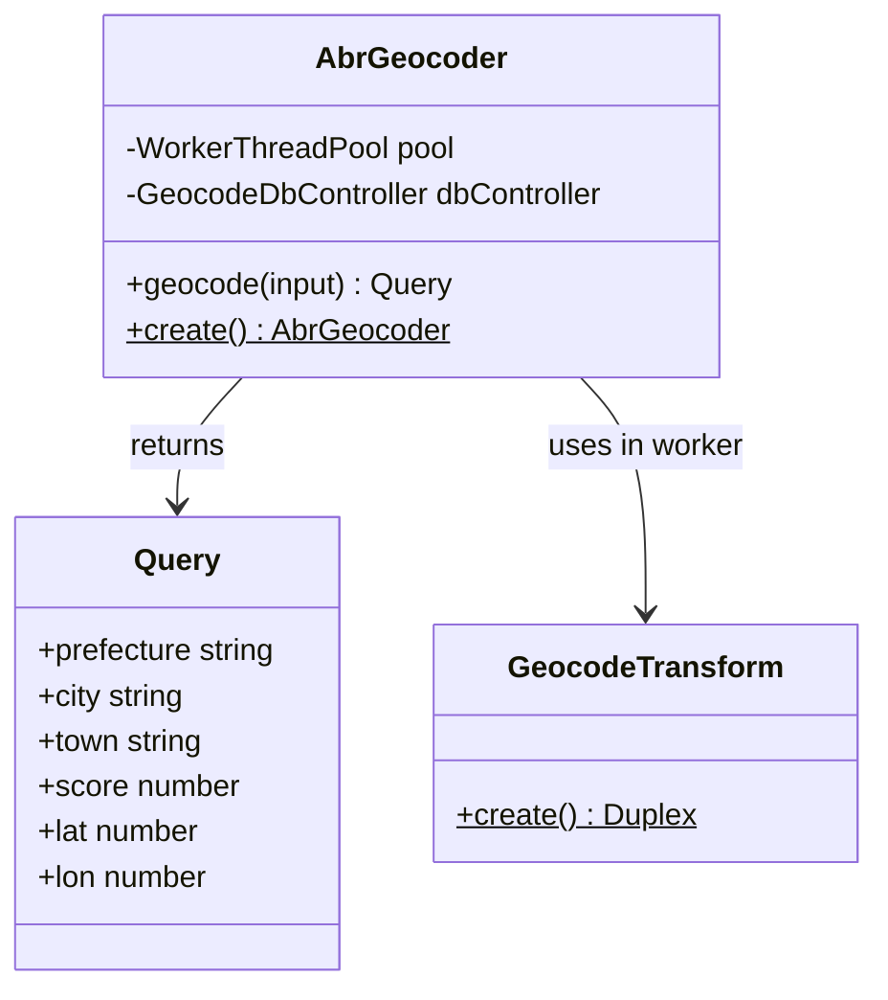
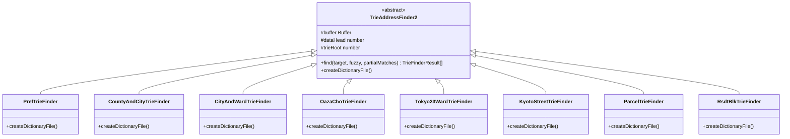
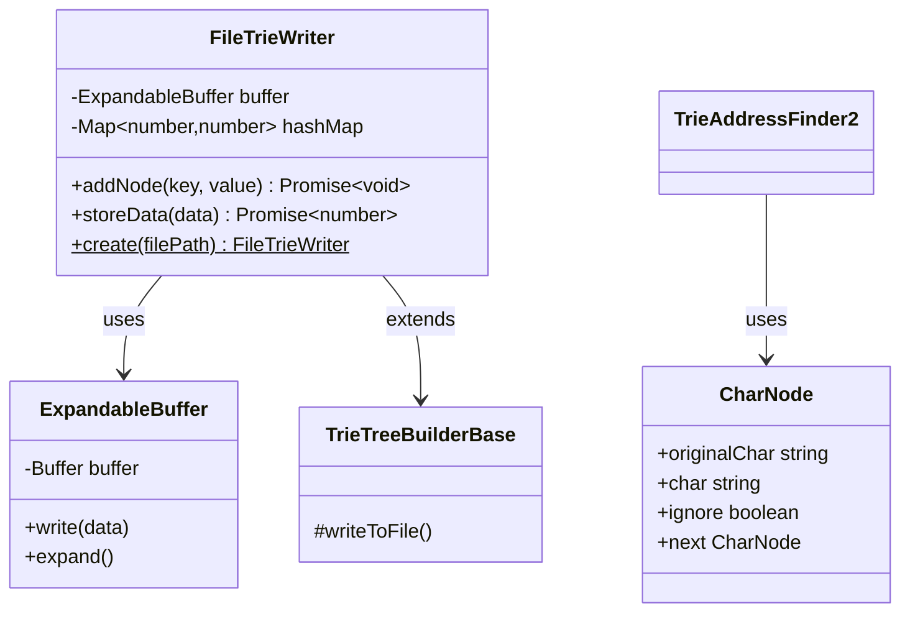
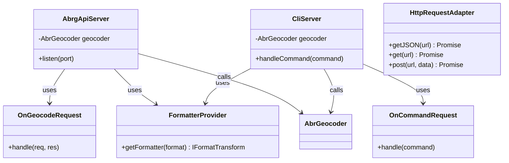
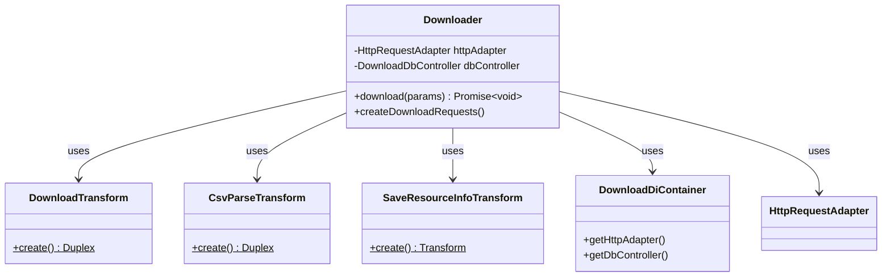
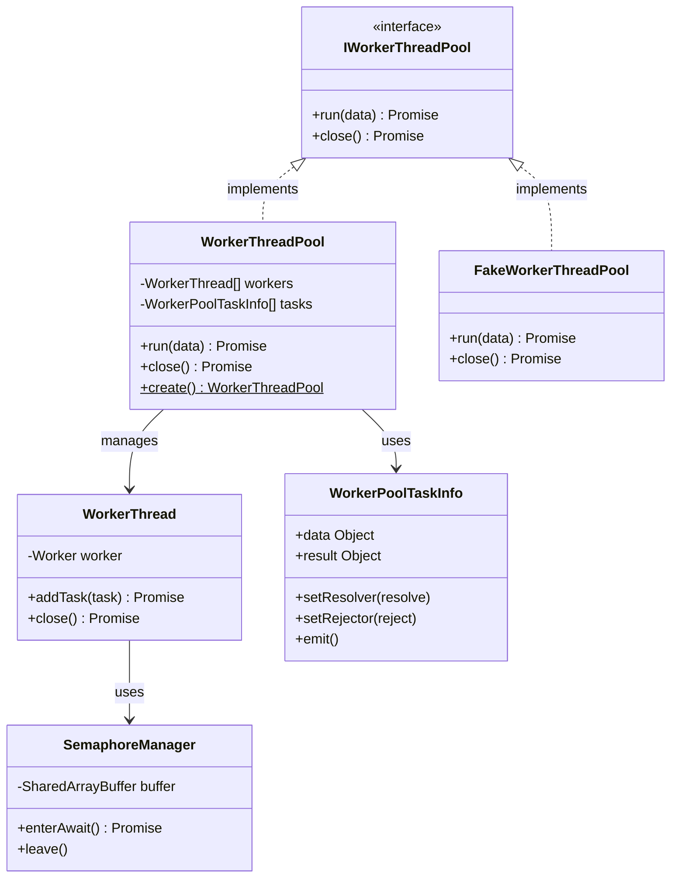
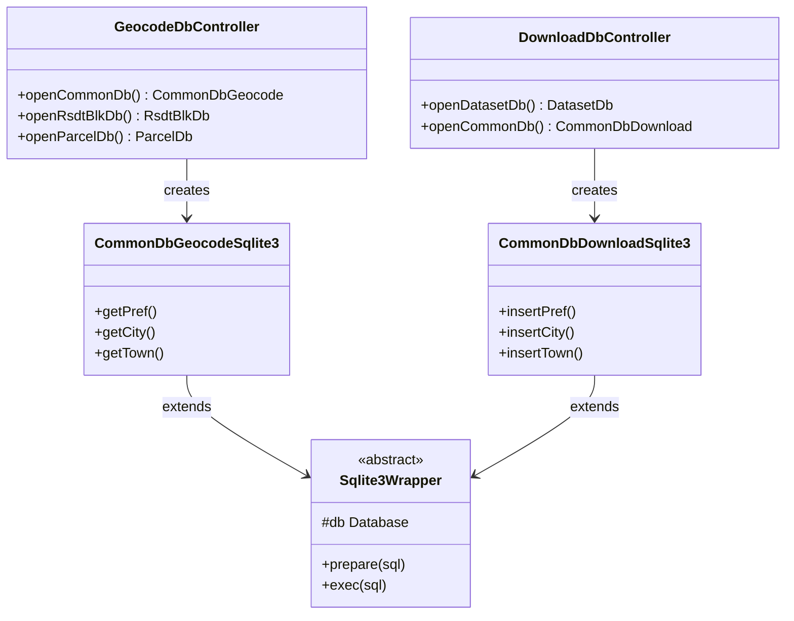

# Classes（クラス図）

ABR Geocoder の主要なクラスと役割を示します。Clean Architecture に基づいた層構造で、各クラスが明確な責務を持ちます。

## このページの目的

ソースコードを読む前に、システム全体のクラス構造を理解することで：

1. **どこに何があるか**: 機能追加や修正時に、どのクラスを変更すべきかが分かる
2. **依存関係の理解**: クラス間の依存を把握し、影響範囲を予測できる
3. **設計意図の把握**: なぜこのような構造になっているかを理解し、一貫性のある改善ができる

## クラス設計の基本方針

### 単一責任の原則（SRP）

各クラスは1つの責務のみを持ちます。例えば：

- **AbrGeocoder**: ジオコーディングのオーケストレーション（Workerの管理と結果の整列）
- **TrieAddressFinder2**: トライ木探索のみ（DB操作やスコアリングは別クラス）
- **FileTrieWriter**: バイナリ書き込みのみ（データ取得は別クラス）

### 依存性逆転の原則（DIP）

上位層は抽象（インターフェース）に依存し、下位層の実装詳細に依存しません：

- **IWorkerThreadPool**: インターフェースを定義し、WorkerThreadPool/FakeWorkerThreadPoolで実装
- **Sqlite3Wrapper**: 抽象クラスでDB操作を定義し、具体的なテーブル操作は派生クラスで実装

### ファクトリーパターン

複雑なオブジェクト生成はstaticメソッド（`create()`）で隠蔽します：

- **WorkerThreadPool.create()**: Worker生成とSharedMemory初期化を内部で処理
- **FileTrieWriter.create()**: ファイルヘッダー書き込みとバッファ初期化を自動化

これにより、利用側は複雑な初期化手順を意識せず、シンプルにインスタンス化できます。

## 全体構成

システム全体の主要クラスと依存関係の概要です。

**依存の方向性**:
- API/CLI層 → Geocoding Core → Worker Pool/Trie Finder
- Download System → Data Structures → Database Layer
- すべての層 → Database Layer（データ永続化）

## Geocoding Core（ジオコーディング中核）

ジオコーディング処理を担当する主要クラス群です。

### 役割の詳細

#### AbrGeocoder

ジオコーディングのメインエントリポイント。以下を担当：

1. **Worker管理**: WorkerThreadPoolを初期化し、並列処理を制御
2. **タスク投入**: 入力住所をWorkerに分配
3. **結果整列**: Worker間で完了順序がバラバラでも、入力順に結果を返却（TaskInfo連結リストで実現）

**Node.js的なポイント**:
- `geocode(input: string): Promise<Query>` というシンプルなAPIで複雑な並列処理を隠蔽
- 内部的にはWorker Threadsを使用するが、呼び出し側はasync/awaitで扱える

#### Query

ジオコーディング結果を表現するイミュータブルなデータモデル：

- 住所階層（都道府県、市区町村、町字、番地等）
- 座標（緯度経度）
- マッチングスコア（0-1の範囲で一致度を表現）

**設計思想**: Value Objectとして不変性を保証し、副作用のない安全な値の受け渡しを実現

#### GeocodeTransform

Workerスレッド内で動作するNode.js Duplexストリーム：

- **入力**: 住所文字列
- **処理**: 正規化 → Trie検索 → スコアリング
- **出力**: Query オブジェクト

**Node.js的なポイント**:
- Transformストリームのパイプライン処理で、複数の変換ステップを組み合わせ
- バックプレッシャー対応により、メモリを圧迫せずに大量データを処理

## Trie Finder（トライ木検索）

各レベルの住所データを検索するトライ木ファインダー群です。継承により共通処理を再利用しつつ、データソースごとに特化した検索を実現します。

### 役割の詳細

#### TrieAddressFinder2（基底クラス）

トライ木探索の共通ロジックを実装：

1. **バッファアクセス**: SharedArrayBufferからトライ木ノードを読み出し
2. **再帰探索**: 文字列を1文字ずつトライ木に沿って探索
3. **あいまい一致**: ワイルドカード（`?`）や補助チャレンジ（異体字、略称等）に対応

**技術的特徴**:
- バッファオフセット計算により、ファイルI/Oなしでメモリ上のバイナリデータを直接読み取り
- 再帰的な探索により、前方一致/部分一致/あいまい一致を同時に処理

#### 各サブクラスの役割

| クラス名 | 対象データ | 特殊処理 |
|---------|----------|---------|
| **PrefTrieFinder** | 都道府県 | 標準的な探索のみ |
| **CountyAndCityTrieFinder** | 郡+市 | 郡と市の組み合わせパターン |
| **CityAndWardTrieFinder** | 市+区 | 政令指定都市の区対応 |
| **OazaChoTrieFinder** | 大字+丁目+小字 | 地方自治体コード（LGコード）で分離 |
| **Tokyo23WardTrieFinder** | 東京23区 | 東京都特別区の特殊処理 |
| **KyotoStreetTrieFinder** | 京都通り名 | 京都独自の通り名表記 |
| **ParcelTrieFinder** | 地番 | 地番（土地の番号）の検索 |
| **RsdtBlkTrieFinder** | 住居表示（街区） | 住居表示の街区符号・住居番号 |

**設計ポイント**:
- 基底クラスで共通処理を実装し、サブクラスで `createDictionaryFile()` をオーバーライド
- 各サブクラスは対応するDBテーブルからデータを読み、専用の辞書ファイルを生成

## Data Structures（データ構造）

トライ木の構築と永続化を担当するクラス群です。

### 役割の詳細

#### FileTrieWriter

バイナリトライ木（ABRG2形式）をファイルに永続化するクラス：

1. **ヘッダー書き込み**: マジックナンバー、バージョン、エントリポイント
2. **ノード追加**: `addNode(key, value)` で文字列をトライ木に追加
3. **データ圧縮**: JSONをgzip圧縮し、FNV-1aハッシュで重複排除

**Node.js的なポイント**:
- Bufferを直接操作して高速なバイナリI/O
- async/awaitでファイル書き込みの非同期処理を制御
- メモリバッファリング（8MB）で書き込み回数を削減

**アルゴリズム**:
- トライ木の各ノードは `sibling/child` ポインタで連結
- データノードはハッシュ連結リストで衝突を解決
- 同一データは1回だけ保存（ハッシュ値で判定）

#### CharNode

ジオコーディング検索時の文字ノードを表現する連結リスト：

- **originalChar**: 元の文字（正規化前）
- **char**: 正規化後の文字
- **ignore**: スキップすべき文字（空白、ハイフン等）
- **next**: 次の文字ノード

**設計思想**: 文字列を配列ではなく連結リストで表現することで、文字の挿入/削除/スキップを柔軟に処理

#### ExpandableBuffer

動的に拡張可能なバッファ。容量不足時に自動的にサイズを2倍に拡張：

**Node.js的なポイント**:
- Bufferのサイズは固定なので、拡張時には新しいBufferを確保してコピー
- 事前に大きめのバッファを確保することで、拡張回数を最小化

#### TrieTreeBuilderBase

トライ木構築の基底クラス。ファイル書き込みの共通処理を提供：

- ファイルディスクリプタの管理
- オフセット位置の追跡
- 前方書換（既に書いたノードのポインタを後から更新）

## API/CLI Layer（インターフェース層）

REST APIとCLIのエントリポイントです。

### 役割の詳細

#### AbrgApiServer / CliServer

**AbrgApiServer**:
- hyper-expressベースのHTTPサーバー
- RESTful APIとして `GET /geocode?address=...` を提供
- 1件ずつのリクエストに対応

**CliServer**:
- コマンドライン引数を解析してAbrGeocoderを呼び出し
- ストリーム処理で標準入力から大量住所を読み込み
- 標準出力に結果を出力（パイプライン処理に最適）

**Node.js的なポイント**:
- `process.stdin` / `process.stdout` をStreamとして扱い、メモリ効率的に処理
- Transformストリームをパイプラインで接続: `stdin → geocode → format → stdout`

#### FormatterProvider

出力フォーマッターを提供するファクトリクラス：

- **JSON**: 標準的なJSON形式
- **CSV**: 表計算ソフトで開けるCSV形式
- **GeoJSON**: 地理情報システム（GIS）標準形式
- **NDJSON**: Newline Delimited JSON（ストリーム処理に最適）

**設計ポイント**: Strategy パターンでフォーマット処理を差し替え可能に

#### HttpRequestAdapter

HTTP通信の抽象化レイヤー。テスト時にはモック実装に差し替え可能：

**Node.js的なポイント**:
- fetch API（Node.js 18+標準）またはnode-fetchを使用
- async/awaitでPromiseベースの非同期処理
- タイムアウト、リトライ、エラーハンドリングを一箇所に集約

## Download System（ダウンロードシステム）

データセットのダウンロードと処理を担当します。

### 役割の詳細

#### Downloader

データセットダウンロード処理のオーケストレーター：

1. DCATメタデータから配布URLリストを生成
2. 各URLをキューに投入し、並列ダウンロード
3. CSVパース → DB投入をストリームパイプライン処理
4. キャッシュファイル（ABRG2）を生成

**Node.js的なポイント**:
- Promiseの並列実行（`Promise.all()`）で複数ファイルを同時ダウンロード
- Streamのバックプレッシャー制御でメモリ使用量を抑制

#### DownloadTransform / CsvParseTransform

**DownloadTransform**:
- HTTPレスポンスボディをStreamとして受信
- zip圧縮されている場合は自動的に展開

**CsvParseTransform**:
- CSV行をパースしてオブジェクトに変換
- バリデーション（必須フィールドチェック等）
- SQLiteへのバッチインサート

**Node.js的なポイント**:
- Transformストリームを継承し、`_transform()` メソッドで変換処理を実装
- チャンク単位で処理するため、巨大ファイルでもメモリ効率的

#### SaveResourceInfoTransform

ダウンロード済みリソースのメタ情報（ETag、最終更新日時等）をDBに保存：

**目的**: 次回ダウンロード時に、更新されたファイルのみを再取得（差分更新）

## Worker Thread Pool（ワーカースレッドプール）

並列処理を実現するスレッドプール管理です。

### 役割の詳細

#### WorkerThreadPool

ワーカースレッド管理の中核：

1. **初期化**: CPU数に応じたWorkerを起動
2. **タスク分配**: ラウンドロビンで空いているWorkerにタスク投入
3. **結果収集**: 各Workerからの結果をTaskInfoに格納
4. **順序保証**: 入力順にPromiseを解決（TaskInfo連結リストで実現）

**Node.js的なポイント**:
- `worker_threads` モジュールでマルチコアCPUを活用
- SharedArrayBufferでWorker間のデータ共有（コピーレス）
- MessageChannelでWorkerとメインスレッド間の通信

**アルゴリズム**:
- タスクは連結リストで管理し、完了順序に関わらず入力順に結果を返却
- バックプレッシャー: `maxTasksPerWorker` で同時実行タスク数を制限

#### WorkerThread

個別ワーカースレッドのラッパー：

- **起動**: Workerスクリプトをロードし、初期化データを送信
- **タスク実行**: `postMessage()` でタスクを送信し、結果を `on('message')` で受信
- **終了**: `terminate()` でWorkerを強制終了、または `close()` で正常終了を待機

#### SemaphoreManager

SharedArrayBufferを使用したセマフォ実装：

**用途**: ファイル書き込み時の排他制御（複数Workerが同時に書き込まないよう制御）

**Node.js的なポイント**:
- `Atomics.wait()` / `Atomics.notify()` でスレッド間同期
- ポーリングではなくブロッキング待機により、CPU使用率を抑制

#### FakeWorkerThreadPool

テスト/デバッグ用のモック実装：

**目的**: Worker Threadsを使わずにメインスレッドで実行することで、デバッガーで追跡可能に

**設計ポイント**: IWorkerThreadPoolインターフェースに準拠し、本番とテストで実装を差し替え

## Database Layer（データベース層）

SQLiteデータベースへのアクセスを管理します。

### 役割の詳細

#### GeocodeDbController / DownloadDbController

**GeocodeDbController**:
- ジオコーディング時（読み取り専用）のDB接続を管理
- 複数のWorkerから同時アクセス可能（SQLiteのWALモード）

**DownloadDbController**:
- ダウンロード時（書き込み）のDB接続を管理
- トランザクション制御でデータ一貫性を保証

**設計ポイント**: 読み取りと書き込みでControllerを分離し、責務を明確化

#### CommonDbGeocodeSqlite3 / CommonDbDownloadSqlite3

**CommonDbGeocodeSqlite3**（読み取り用）:
- `getPref()`, `getCity()` などのSELECTクエリ
- インデックスを活用した高速検索

**CommonDbDownloadSqlite3**（書き込み用）:
- `insertPref()`, `insertCity()` などのINSERTクエリ
- バッチインサートで高速化

**Node.js的なポイント**:
- better-sqlite3（同期API）でシンプルなコード
- Prepared Statementでインジェクション対策とパフォーマンス向上

#### Sqlite3Wrapper

better-sqlite3ライブラリのラッパー抽象クラス：

**目的**:
- 共通的なDB操作（prepare, exec, transaction）を提供
- テスト時にモック実装に差し替え可能

## クラス間の主要な依存関係

以下の依存関係により、システム全体が協調動作します：

1. **API/CLI → Geocoding Core**: AbrgApiServer/CliServer が AbrGeocoder を呼び出し
2. **Geocoding Core → Worker Pool**: AbrGeocoder が WorkerThreadPool を管理し、並列処理を実現
3. **Geocoding Core → Trie Finder**: AbrGeocoder が各 TrieAddressFinder2 サブクラスを使用して段階的検索
4. **Download → Data Structures**: Downloader が FileTrieWriter を使用してABRG2キャッシュを生成
5. **All → Database**: すべてのレイヤーが GeocodeDbController/DownloadDbController を介してDB操作

## コントリビューションのヒント

### パフォーマンス改善

- **WorkerThreadPool**: タスクスケジューリングアルゴリズムの改善
- **TrieAddressFinder2**: 探索アルゴリズムの最適化（枝刈り、キャッシング等）
- **FileTrieWriter**: バッファサイズやハッシュアルゴリズムのチューニング

### 機能追加

- **新しいFinder**: 特定地域（北海道、沖縄等）の特殊処理に対応
- **新しいFormatter**: 新しい出力形式（KML, Shapefile等）のサポート
- **新しいAPI**: バッチジオコーディングAPIの追加

### テスト強化

- **FakeWorkerThreadPool**: テストカバレッジの向上に活用
- **Sqlite3Wrapper**: モック実装でDBなしのユニットテストを実現
- **E2Eテスト**: 実データでのエンドツーエンドテスト

このクラス図を参照しながらソースコードを読むことで、システム全体の理解が深まります。ぜひGitHub PRで改善提案をお寄せください！
