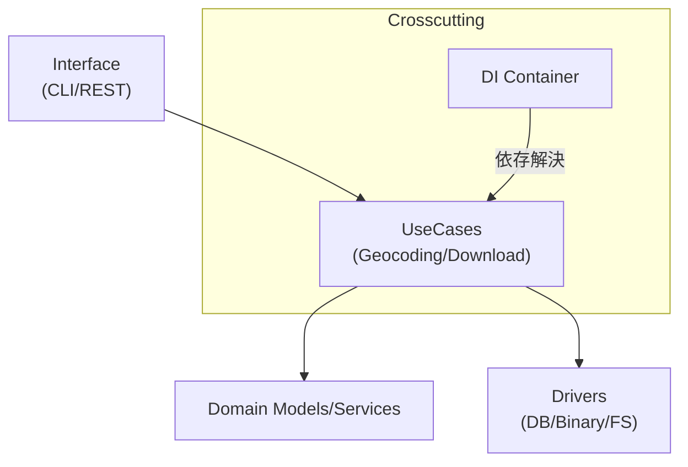

# Clean Architecture / DI 方針

本プロジェクトは、層間の依存を一方向に保ち、実装差し替えやテスト容易性を確保するためのクリーンアーキテクチャ/DI を採用しています。

レイヤーの役割:

- Interface: CLI/REST API（入出力/プロトコル変換）
- UseCases: アプリケーションフロー（ジオコーディング・ダウンロード）
- Domain: 値オブジェクト/ユーティリティ（正規化、ハッシュ、スレッド制御、表記変換など）
- Drivers: SQLite アクセス、ABRG2 読み書き（IO 層）

DI による分岐削減:

- `AbrGeocoderDiContainer`/`DownloadDiContainer` が DB 接続情報やキャッシュディレクトリ、ロガー等を提供し、UseCase 側の条件分岐を最小化
- テストではモック DB/HTTP を注入してユースケースの分岐を抑制

依存方向:

- Interface → UseCases → Domain/Drivers（内向き依存）。Domain は最小依存。

