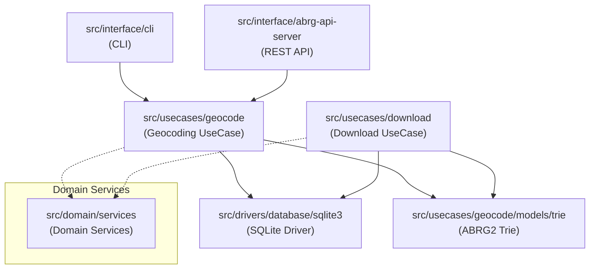

# Components（コンポーネント構成）

ABR Geocoderのソースコード構成を、ディレクトリ単位で説明します。各ディレクトリは明確な責務を持ち、Clean Architectureの層構造に従っています。

## ディレクトリ構成の概要



## Interface Layer（インターフェース層）

ユーザーとシステムの接点となる層です。

### src/interface/abrg-api-server

RESTful APIサーバーの実装。hyper-expressベースで高速なHTTP処理を提供します。

**主要ファイル**:
- `index.ts`: サーバー起動とルーティング設定
- `on-geocode-request.ts`: `/geocode` エンドポイントのハンドラー
- `cors.ts`: CORS設定（クロスオリジンリクエスト対応）

**技術的特徴**:
- hyper-expressは Express互換で、より高速な処理が可能
- クエリパラメータを受け取り、AbrGeocoderを呼び出し
- 結果をJSON形式で返却（または指定されたフォーマット）

**使用例**:
```bash
curl "http://localhost:3000/geocode?address=東京都千代田区霞が関1-1-1"
```

### src/interface/cli

コマンドラインインターフェースの実装。標準入出力を使ったストリーム処理。

**主要ファイル**:
- `index.ts`: CLI起動とコマンド解析
- `geocode-command.ts`: `geocode` コマンドの実装
- `download-command.ts`: `download` コマンドの実装

**技術的特徴**:
- `process.stdin` から住所を1行ずつ読み込み
- Transformストリームでジオコーディング処理
- `process.stdout` に結果を出力（パイプライン処理に最適）

**使用例**:
```bash
# ファイルから一括ジオコーディング
cat addresses.txt | abr-geocoder geocode --format=csv > results.csv

# ストリーム処理で大量データを効率的に処理
zcat huge-addresses.txt.gz | abr-geocoder geocode | gzip > results.json.gz
```

### src/interface/format

出力フォーマッターの実装。Strategy パターンで複数形式に対応。

**主要ファイル**:
- `formatter-provider.ts`: フォーマッター取得のファクトリ
- `json-formatter.ts`: JSON形式
- `csv-formatter.ts`: CSV形式
- `geojson-formatter.ts`: GeoJSON形式
- `ndjson-formatter.ts`: NDJSON形式（ストリーム処理向け）

**設計ポイント**:
- 各フォーマッターは `IFormatTransform` インターフェースを実装
- Transformストリームなので、パイプラインに組み込み可能

## UseCase Layer（ユースケース層）

アプリケーションロジックを実装する層です。

### src/usecases/geocode

ジオコーディング処理のユースケース実装。

**ディレクトリ構成**:
```
src/usecases/geocode/
├── abr-geocoder.ts           # メインエントリポイント
├── worker/
│   └── geocode-worker.ts     # Workerスレッドで動作する処理
├── models/
│   ├── query.ts              # ジオコード結果のモデル
│   ├── trie/                 # トライ木関連
│   │   ├── trie-finder2.ts   # 基底クラス
│   │   └── file-trie-writer.ts
│   ├── pref-trie-finder.ts
│   ├── city-and-ward-trie-finder.ts
│   └── ...（各種Finder）
└── services/
    ├── normalization.ts      # 住所正規化
    └── scoring.ts            # スコアリング
```

**主要な処理フロー**:
1. **AbrGeocoder**: Worker Poolを管理し、タスクを分配
2. **Worker**: ストリーム処理で住所を正規化 → Trie探索 → スコアリング
3. **Finder**: 各階層（都道府県、市区、町字等）のトライ木を探索
4. **Query**: 結果を構造化したオブジェクトとして返却

**技術的特徴**:
- Worker Threadsで並列処理を実現（CPUコア数に応じて自動スケール）
- SharedArrayBufferでトライ木データを共有（メモリコピー不要）
- TaskInfo連結リストで入力順序を保証

### src/usecases/download

データセットのダウンロードとDB投入のユースケース実装。

**ディレクトリ構成**:
```
src/usecases/download/
├── download-process.ts       # ダウンロードオーケストレーター
├── transformations/
│   ├── download-transform.ts # HTTPダウンロード
│   ├── csv-parse-transform.ts # CSVパース→DB投入
│   └── save-resource-info-transform.ts # メタデータ保存
└── models/
    └── download-di-container.ts # DI Container
```

**主要な処理フロー**:
1. DCATメタデータから配布URLを抽出
2. URLをキューに投入し、並列ダウンロード
3. Streamパイプライン: Download → Unzip → CSV Parse → DB Insert
4. 完了後、各FinderがABRG2キャッシュを生成

**技術的特徴**:
- Streamのバックプレッシャー制御で、メモリを節約しつつ高速処理
- ETagベースの差分更新（変更されたファイルのみダウンロード）
- トランザクション制御でDB一貫性を保証

## Driver Layer（ドライバー層）

外部システム（DB、ファイルシステム等）への アクセスを抽象化します。

### src/drivers/database/sqlite3

SQLiteデータベースドライバーの実装。

**ディレクトリ構成**:
```
src/drivers/database/sqlite3/
├── better-sqlite3-wrap.ts    # better-sqlite3ラッパー
├── geocode/
│   ├── common-db-geocode-sqlite3.ts    # 検索用（読み取り専用）
│   ├── rsdt-blk-db-sqlite3.ts
│   └── parcel-db-sqlite3.ts
└── download/
    └── common-db-download-sqlite3.ts   # 更新用（書き込み）
```

**設計ポイント**:
- 読み取りと書き込みでクラスを分離（CQRS的なアプローチ）
- Prepared Statementでパフォーマンスとセキュリティを両立
- WALモードで複数Workerからの同時読み取りに対応

**Node.js的なポイント**:
- better-sqlite3は同期APIなので、コードがシンプル
- ただし、同期処理はEventLoopをブロックするため、CPUバウンドな処理に限定

## Domain Layer（ドメイン層）

ビジネスロジックやドメイン固有のサービスを提供します。

### src/domain/services

再利用可能なドメインサービスの実装。

**主要なサービス**:

#### thread（スレッド管理）
- `worker-thread-pool.ts`: Worker Threadsの管理
- `worker-thread.ts`: 個別Workerのラッパー
- `semaphore-manager.ts`: SharedArrayBuffer版セマフォ

**技術的特徴**:
- `Atomics.wait()` / `Atomics.notify()` でスレッド間同期
- 連結リストでタスク順序を保証

#### regex（正規表現と正規化）
- `address-normalizer.ts`: 住所文字列の正規化
- `kan-to-num.ts`: 漢数字→算用数字変換
- `zen-to-han.ts`: 全角→半角変換

**技術的特徴**:
- Unicode正規化（NFC）で異体字を統一
- 正規表現のキャッシングでパフォーマンス向上

#### hash（ハッシュ関数）
- `fnv1a.ts`: FNV-1a 64bitハッシュ
- `crc32.ts`: CRC32チェックサム

**技術的特徴**:
- Bufferを直接操作して高速計算
- ハッシュ衝突時の連結リスト処理

#### file（ファイルシステム）
- `file-utils.ts`: ファイル操作のユーティリティ
- `directory-scanner.ts`: ディレクトリ走査

## Trie Models（トライ木データ構造）

### src/usecases/geocode/models/trie

ABRG2形式のトライ木実装。

**主要ファイル**:
- `file-trie-writer.ts`: バイナリ書き込み
- `trie-finder2.ts`: バイナリ読み込みと探索
- `expandable-buffer.ts`: 動的拡張バッファ
- `char-node.ts`: 文字ノード（連結リスト）

**ABRG2フォーマット**:
```
[Header]
- magic: "abrg" (4B)
- version: 2.2 (2B)
- trie_root: offset (4B)
- data_head: offset (4B)

[Trie Nodes]
- size (1B) + sibling (4B) + child (4B) + hash_list (4B) + name (var)

[Data Nodes]
- next (4B) + size (2B) + hash (8B) + data (gzip JSON)
```

**技術的特徴**:
- Big Endianで整列（クロスプラットフォーム対応）
- ハッシュ連結リストで重複データを排除
- gzip圧縮でディスク使用量を削減

## 層間の依存関係

```
Interface Layer (CLI, REST API)
    ↓
UseCase Layer (Geocode, Download)
    ↓
Driver Layer (SQLite, FileSystem)
    ↓
Infrastructure (OS, Node.js Runtime)
```

**依存の方向**: 常に外側から内側（上位層 → 下位層）

**Domain Layerは独立**: すべての層から参照されるが、他層に依存しない

## コントリビューションのヒント

### 新しいFinderの追加

1. `src/usecases/geocode/models/` に新しいFinderクラスを作成
2. `TrieAddressFinder2` を継承
3. `createDictionaryFile()` をオーバーライドしてDB→Trie変換を実装

### 新しいフォーマッターの追加

1. `src/interface/format/` に新しいFormatterを作成
2. `IFormatTransform` インターフェースを実装
3. `formatter-provider.ts` に登録

### パフォーマンス改善

- `src/domain/services/thread/`: Worker管理の最適化
- `src/usecases/geocode/models/trie/`: トライ木探索アルゴリズムの改善
- `src/drivers/database/sqlite3/`: クエリ最適化、インデックス追加

このコンポーネント構成を理解することで、変更すべきファイルが明確になり、効率的な開発が可能になります。

