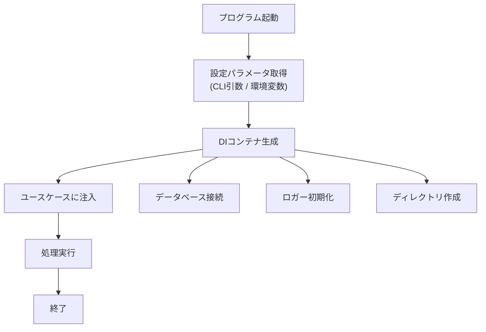

# Dependency Injection（依存性注入）

このページでは、Dependency Injection（DI）の基礎から、ABR Geocoderでの実装方法、テスタビリティ向上のメリットまでを詳しく説明します。

## DIとは何か？

### 依存性の問題

まず、DIを使わない場合の問題を見てみましょう。

**悪い例（依存性が固定されている）**：

```typescript
class UserService {
  private database: MySQLDatabase;

  constructor() {
    // MySQLDatabaseに直接依存している
    this.database = new MySQLDatabase({
      host: 'localhost',
      port: 3306,
      user: 'root',
      password: 'password',
    });
  }

  async getUser(id: number) {
    return await this.database.query('SELECT * FROM users WHERE id = ?', [id]);
  }
}
```

**問題点**：

1. **テストが困難**: 実際のMySQLデータベースが必要になる
2. **環境切り替えが困難**: 本番/開発/テストで別のDB設定を使いたい場合、コードを変更する必要がある
3. **拡張性がない**: PostgreSQLに変更したい場合、UserServiceのコードを書き換える必要がある

### DIによる解決

Dependency Injection（依存性注入）は、クラスの依存関係を外部から与える設計パターンです。

**良い例（依存性を外部から注入）**：

```typescript
// データベースのインターフェース
interface IDatabase {
  query(sql: string, params: any[]): Promise<any[]>;
}

class UserService {
  // インターフェースに依存
  constructor(private database: IDatabase) {}

  async getUser(id: number) {
    return await this.database.query('SELECT * FROM users WHERE id = ?', [id]);
  }
}

// 使用例
const db = new MySQLDatabase({ /* 設定 */ });
const userService = new UserService(db); // 依存性を注入
```

**メリット**：

1. **テスト容易性**: モックデータベースを注入してテスト可能
2. **柔軟な設定**: 環境に応じて異なるデータベースを注入できる
3. **拡張性**: PostgreSQLに変更してもUserServiceのコードは変わらない

## なぜDIが必要か？

### 問題：分岐だらけのコード

DIを使わないと、環境や設定による分岐がコード全体に散在します。

```typescript
// ❌ 悪い例：分岐だらけ
class AbrGeocoder {
  private database: any;
  private logger: any;
  private cacheDir: string;

  constructor(options: any) {
    // 環境による分岐
    if (process.env.NODE_ENV === 'test') {
      this.database = new MockDatabase();
      this.logger = new NullLogger();
      this.cacheDir = '/tmp/test-cache';
    } else if (process.env.NODE_ENV === 'development') {
      this.database = new SQLiteDatabase('dev.db');
      this.logger = new ConsoleLogger();
      this.cacheDir = './cache';
    } else {
      this.database = new SQLiteDatabase('prod.db');
      this.logger = new FileLogger('/var/log/abr.log');
      this.cacheDir = '/var/cache/abr';
    }

    // データベースの種類による分岐
    if (options.dbType === 'sqlite') {
      this.database = new SQLiteDatabase(options.dbPath);
    } else if (options.dbType === 'postgres') {
      this.database = new PostgreSQLDatabase(options.dbConfig);
    }
  }

  async geocode(address: string) {
    // ロガーがあるかチェック
    if (this.logger) {
      this.logger.log(`Geocoding: ${address}`);
    }

    // データベースの種類によって呼び出し方が違う
    if (this.database instanceof SQLiteDatabase) {
      return await this.database.querySync('SELECT ...');
    } else {
      return await this.database.query('SELECT ...');
    }
  }
}
```

**問題点**：

- ユースケース（geocode）の中に、インフラ選択のif/elseが混在
- 新しい環境を追加するたびにコード修正が必要
- テスト用の分岐がプロダクションコードに残る
- バグの温床（条件分岐が複雑すぎて把握できない）

### 解決：DIコンテナで集約

DIコンテナを使うと、依存関係の構築をコンテナに集約できます。

```typescript
// ✅ 良い例：DIコンテナで集約
class AbrGeocoderDiContainer {
  public readonly database: GeocodeDbController;
  public readonly logger?: DebugLogger;
  public readonly cacheDir: string;

  constructor(params: AbrGeocoderDiContainerParams) {
    // 依存関係の構築はコンテナ内で完結
    this.database = new GeocodeDbController({
      connectParams: params.database,
    });

    if (params.debug) {
      this.logger = DebugLogger.getInstance();
    }

    this.cacheDir = params.cacheDir;
    Object.freeze(this); // イミュータブル化
  }
}

class AbrGeocoder {
  constructor(private container: AbrGeocoderDiContainer) {}

  async geocode(address: string) {
    // 分岐なし！コンテナから取得するだけ
    this.container.logger?.log(`Geocoding: ${address}`);
    return await this.container.database.query('SELECT ...');
  }
}

// 使用例
const container = new AbrGeocoderDiContainer({
  database: { type: 'sqlite3', dataDir: './data' },
  cacheDir: './cache',
  debug: true,
});

const geocoder = new AbrGeocoder(container);
```

**メリット**：

- ユースケースコードから分岐が消える
- 環境による違いはコンテナ初期化時に吸収
- テスト時はモックコンテナを注入するだけ
- 新しい環境でも、新しいコンテナを作るだけで対応可能

## ABR GeocoderのDI実装

### DIコンテナの種類

ABR Geocoderでは、ユースケースごとに専用のDIコンテナを用意しています。

#### 1. CommonDiContainer（基底クラス）

すべてのDIコンテナの基底クラスです。

```typescript
// src/domain/models/common-di-container.ts
export class CommonDiContainer {
  public readonly env: EnvProvider;

  constructor() {
    this.env = new EnvProvider();
  }
}
```

**役割**：
- 環境変数の提供（`EnvProvider`）
- 共通の依存関係を管理

#### 2. AbrGeocoderDiContainer（ジオコーディング用）

ジオコーディング処理で使用する依存関係を集約します。

```typescript
// src/usecases/geocode/models/abr-geocoder-di-container.ts
export type AbrGeocoderDiContainerParams = {
  cacheDir: string;      // ABRG2キャッシュファイルの保存先
  database: DatabaseParams;  // データベース接続情報
  debug: boolean;        // デバッグモード
};

export class AbrGeocoderDiContainer extends CommonDiContainer {
  public readonly database: GeocodeDbController;
  public readonly logger?: DebugLogger;
  public readonly cacheDir: string;

  constructor(private params: AbrGeocoderDiContainerParams) {
    super();

    // データベースコントローラーを生成
    this.database = new GeocodeDbController({
      connectParams: params.database,
    });

    // デバッグモードならロガーを生成
    if (params.debug) {
      this.logger = DebugLogger.getInstance();
    }

    this.cacheDir = params.cacheDir;

    // イミュータブル化（変更不可）
    Object.freeze(this);
  }

  // JSON形式に変換（Worker間でパラメータを渡すため）
  toJSON(): AbrGeocoderDiContainerParams {
    return { ...this.params };
  }
}
```

**提供する依存関係**：

| プロパティ | 型 | 説明 |
|-----------|-----|------|
| `database` | GeocodeDbController | データベースアクセス |
| `logger` | DebugLogger | デバッグログ出力 |
| `cacheDir` | string | ABRG2キャッシュディレクトリ |
| `env` | EnvProvider | 環境変数（継承） |

**使用例**：

```typescript
// CLI起動時
const container = new AbrGeocoderDiContainer({
  cacheDir: path.join(os.homedir(), '.abr-geocoder', 'cache'),
  database: {
    type: 'sqlite3',
    dataDir: path.join(os.homedir(), '.abr-geocoder', 'database'),
  },
  debug: process.env.DEBUG === 'true',
});

const geocoder = new AbrGeocoder(container);
const result = await geocoder.geocode('東京都千代田区霞が関1-1-1');
```

#### 3. DownloadDiContainer（ダウンロード用）

データセットのダウンロードで使用する依存関係を集約します。

```typescript
// src/usecases/download/models/download-di-container.ts
export type DownloadDiContainerParams = {
  cacheDir: string;      // キャッシュファイルの保存先
  downloadDir: string;   // ダウンロードファイルの一時保存先
  database: DatabaseParams;  // データベース接続情報
  keepFiles?: boolean;   // ダウンロードファイルを削除せず保持するか
};

export class DownloadDiContainer extends CommonDiContainer {
  public readonly downloadDir: string;
  public readonly database: DownloadDbController;

  constructor(private params: DownloadDiContainerParams) {
    super();

    this.downloadDir = params.downloadDir;

    // ディレクトリが存在しなければ作成
    makeDirIfNotExists(params.downloadDir);
    makeDirIfNotExists(params.cacheDir);

    // ダウンロード用データベースコントローラーを生成
    this.database = new DownloadDbController(params.database);

    Object.freeze(this);
  }

  get keepFiles(): boolean {
    return this.params.keepFiles || false;
  }

  // データセット一覧を取得するURL
  getPackageListUrl() {
    return new URL(`https://${this.env.hostname}/api/feed/dcat-us/1.1.json`);
  }

  toJSON(): DownloadDiContainerParams {
    return this.params;
  }
}
```

**提供する依存関係**：

| プロパティ | 型 | 説明 |
|-----------|-----|------|
| `database` | DownloadDbController | ダウンロード用DB |
| `downloadDir` | string | ダウンロードディレクトリ |
| `keepFiles` | boolean | ファイル保持フラグ |
| `env` | EnvProvider | 環境変数（継承） |

**使用例**：

```typescript
// ダウンロードコマンド実行時
const container = new DownloadDiContainer({
  cacheDir: path.join(os.homedir(), '.abr-geocoder', 'cache'),
  downloadDir: path.join(os.homedir(), '.abr-geocoder', 'download'),
  database: {
    type: 'sqlite3',
    dataDir: path.join(os.homedir(), '.abr-geocoder', 'database'),
  },
  keepFiles: false,
});

const downloader = new Downloader(container);
await downloader.download({
  lgCodes: ['13'], // 東京都
  concurrentDownloads: 10,
  numOfThreads: 6,
});
```

### コンテナのライフサイクル



**重要な特徴**：

1. **イミュータブル（不変）**: `Object.freeze()` で変更不可
2. **シングルトン**: アプリケーション全体で1つのコンテナを共有
3. **遅延初期化なし**: コンテナ生成時にすべての依存関係を構築

## テスタビリティの向上

### モックによるテスト

DIコンテナを使うと、テスト時にモックを注入できます。

**プロダクションコード**：

```typescript
// src/usecases/geocode/abr-geocoder.ts
class AbrGeocoder {
  constructor(private container: AbrGeocoderDiContainer) {}

  async geocode(address: string) {
    this.container.logger?.log(`Geocoding: ${address}`);

    // データベースから検索
    const result = await this.container.database.query(...);

    return result;
  }
}
```

**テストコード**：

```typescript
// src/usecases/geocode/__tests__/abr-geocoder.test.ts
import { AbrGeocoder } from '../abr-geocoder';
import { AbrGeocoderDiContainer } from '../models/abr-geocoder-di-container';
import { jest } from '@jest/globals';

// DIコンテナをモック化
jest.mock('../models/abr-geocoder-di-container');

describe('AbrGeocoder', () => {
  it('should geocode address', async () => {
    // モックデータベースを用意
    const mockDatabase = {
      query: jest.fn().mockResolvedValue([
        { pref: '東京都', city: '千代田区', lat: 35.6762, lon: 139.6503 }
      ]),
    };

    // モックコンテナを作成
    const mockContainer = {
      database: mockDatabase,
      logger: undefined,
      cacheDir: '/tmp/test-cache',
    };

    // DIコンテナとして注入
    const geocoder = new AbrGeocoder(mockContainer as any);

    // テスト実行
    const result = await geocoder.geocode('東京都千代田区霞が関1-1-1');

    // 検証
    expect(mockDatabase.query).toHaveBeenCalled();
    expect(result).toEqual([
      { pref: '東京都', city: '千代田区', lat: 35.6762, lon: 139.6503 }
    ]);
  });
});
```

**メリット**：

- 実際のデータベース不要
- ファイルシステムのアクセス不要
- テストが高速（数ms）
- テストが安定（外部依存なし）

### モックコンテナの実装

実際のモックコンテナの実装例です。

```typescript
// src/usecases/geocode/models/__mocks__/abr-geocoder-di-container.ts
import { DownloadDbController } from '@drivers/database/download-db-controller';
import { jest } from '@jest/globals';

// データベースコントローラーをモック化
jest.mock('@drivers/database/download-db-controller');

const database = new DownloadDbController({
  type: 'sqlite3',
  dataDir: '~/.abr-geocoder/database_test',
});

const originalModule = jest.requireActual(
  '@usecases/geocode/models/abr-geocoder-di-container'
);

module.exports = {
  ...Object.assign({}, originalModule),
  AbrGeocoderDiContainer: jest.fn(() => {
    return {
      // モック化されたデータベース
      database,

      toJSON: () => {
        return {
          database,
          debug: false,
        };
      },

      logger: undefined,
    };
  }),
};
```

**使い方**：

```typescript
// テストファイルの先頭で
jest.mock('@usecases/geocode/models/abr-geocoder-di-container');

// あとは通常通りコンテナを使うだけ
const container = new AbrGeocoderDiContainer({ /* ... */ });
// → 自動的にモックが注入される
```

## DIのメリットまとめ

### 1. 分岐削減

```typescript
// ❌ DIなし：分岐だらけ
if (env === 'test') {
  db = mockDB;
} else if (env === 'dev') {
  db = devDB;
} else {
  db = prodDB;
}

// ✅ DIあり：分岐なし
const db = container.database; // コンテナから取得するだけ
```

### 2. テスタビリティ

```typescript
// ❌ DIなし：実際のDBが必要
const geocoder = new AbrGeocoder();
await geocoder.geocode('東京都'); // 実DBにアクセス

// ✅ DIあり：モック注入
const geocoder = new AbrGeocoder(mockContainer);
await geocoder.geocode('東京都'); // モックDBにアクセス
```

### 3. 層の独立性

```
Interface Layer (CLI, REST API)
    ↓ DIコンテナを注入
UseCase Layer (Geocode, Download)
    ↓ コンテナ経由でアクセス
Driver Layer (SQLite, FileSystem)
```

- UseCasesはInterfaceに依存しない
- UseCasesはDriversに直接依存しない
- すべての依存関係はコンテナ経由

### 4. 環境切り替えが容易

```typescript
// 開発環境
const devContainer = new AbrGeocoderDiContainer({
  database: { type: 'sqlite3', dataDir: './dev-data' },
  cacheDir: './dev-cache',
  debug: true,
});

// 本番環境
const prodContainer = new AbrGeocoderDiContainer({
  database: { type: 'sqlite3', dataDir: '/var/lib/abr-geocoder' },
  cacheDir: '/var/cache/abr-geocoder',
  debug: false,
});

// コード変更不要！
const geocoder = new AbrGeocoder(container);
```

## Node.js特有のポイント

### 1. Object.freeze() でイミュータブル化

```typescript
constructor(params: AbrGeocoderDiContainerParams) {
  this.database = new GeocodeDbController(...);
  this.logger = new DebugLogger();
  this.cacheDir = params.cacheDir;

  // プロパティを変更不可にする
  Object.freeze(this);
}

// これはエラーになる
container.database = new OtherDatabase(); // TypeError
```

**理由**：
- コンテナは設定の集約なので、途中で変更されると混乱する
- バグの原因になりやすい変更を防ぐ

### 2. toJSON() でシリアライズ可能

```typescript
toJSON(): AbrGeocoderDiContainerParams {
  return { ...this.params };
}

// Worker Threadsに渡す際に使用
const containerParams = container.toJSON();
worker.postMessage({ containerParams });
```

**理由**：
- Worker Threadsはシリアライズ可能なデータしか渡せない
- コンテナ自体は渡せないが、パラメータだけ渡してWorker側で再構築

### 3. シングルトンパターン（DebugLogger）

```typescript
if (params.debug) {
  // シングルトンインスタンスを取得
  this.logger = DebugLogger.getInstance();
}
```

**理由**：
- ロガーは複数インスタンスを作る必要がない
- メモリ効率化

## コントリビューションのヒント

### 新しい依存関係の追加

既存のコンテナに新しい依存関係を追加する場合：

```typescript
export class AbrGeocoderDiContainer extends CommonDiContainer {
  public readonly database: GeocodeDbController;
  public readonly logger?: DebugLogger;
  public readonly cacheDir: string;

  // 新しい依存関係を追加
  public readonly metricsCollector?: MetricsCollector;

  constructor(private params: AbrGeocoderDiContainerParams) {
    super();
    this.database = new GeocodeDbController(...);
    this.logger = params.debug ? DebugLogger.getInstance() : undefined;
    this.cacheDir = params.cacheDir;

    // 新しい依存関係の初期化
    if (params.enableMetrics) {
      this.metricsCollector = new MetricsCollector();
    }

    Object.freeze(this);
  }
}
```

### 新しいコンテナの作成

新しいユースケース用のコンテナを作る場合：

```typescript
// src/usecases/update-check/models/update-check-di-container.ts
export type UpdateCheckDiContainerParams = {
  cacheDir: string;
  checkInterval: number;
};

export class UpdateCheckDiContainer extends CommonDiContainer {
  public readonly cacheDir: string;
  public readonly checkInterval: number;

  constructor(params: UpdateCheckDiContainerParams) {
    super();
    this.cacheDir = params.cacheDir;
    this.checkInterval = params.checkInterval;
    Object.freeze(this);
  }

  toJSON(): UpdateCheckDiContainerParams {
    return {
      cacheDir: this.cacheDir,
      checkInterval: this.checkInterval,
    };
  }
}
```

### インターフェースの導入

より柔軟にしたい場合は、インターフェースを導入：

```typescript
// データベースのインターフェース
interface IGeocodeDatabase {
  query(sql: string, params: any[]): Promise<any[]>;
  close(): Promise<void>;
}

export class AbrGeocoderDiContainer extends CommonDiContainer {
  // 具象クラスではなくインターフェースに依存
  public readonly database: IGeocodeDatabase;

  constructor(params: AbrGeocoderDiContainerParams) {
    super();

    // 実装クラスを注入
    this.database = new GeocodeDbController(...);
    // または
    // this.database = new PostgresDbController(...);

    Object.freeze(this);
  }
}
```

### テスト用のファクトリ関数

テスト用のコンテナを簡単に作るヘルパー：

```typescript
// __tests__/helpers/create-test-container.ts
export function createTestContainer(
  overrides?: Partial<AbrGeocoderDiContainerParams>
): AbrGeocoderDiContainer {
  const defaults: AbrGeocoderDiContainerParams = {
    database: {
      type: 'sqlite3',
      dataDir: ':memory:', // インメモリDB
    },
    cacheDir: '/tmp/test-cache',
    debug: false,
  };

  return new AbrGeocoderDiContainer({
    ...defaults,
    ...overrides,
  });
}

// テストで使用
const container = createTestContainer({ debug: true });
```

## まとめ

Dependency Injection（DI）により、ABR Geocoderは以下を実現しています：

1. **分岐削減**: ユースケースから環境による分岐を排除
2. **テスタビリティ**: モック注入で高速・安定したテスト
3. **層の独立性**: UseCasesがInterfaceやDriversに直接依存しない
4. **拡張性**: 新しい依存関係を簡単に追加可能

DIコンテナを使うことで、コードがシンプルになり、メンテナンス性とテスタビリティが大幅に向上します！
