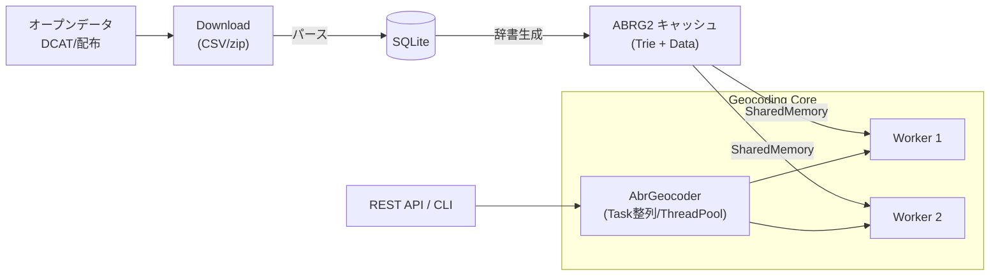

# Overview

ABR Geocoder は、オープンデータ（CSV/zip）を収集・SQLite にロードし、検索に最適化したバイナリ辞書（ABRG2）を生成して高速ジオコーディングを行います。REST API/CLI から同一コアを呼び出せる構成です。

## 主要コンポーネント

### 1. Download（データ取得・前処理）

オープンデータカタログ（DCAT）から住所データをダウンロードし、SQLiteデータベースに格納します。

- **データソース**: 政府が公開する住所データ（CSV/zip形式）
- **処理フロー**:
  1. DCATメタデータから配布URLを抽出
  2. CSV/zipファイルをHTTPダウンロード
  3. CSVをパースしてSQLiteに投入
  4. データセットごとに正規化・検証

**技術ポイント**:
- Node.jsのStreamを活用した大容量ファイル処理
- 並列ダウンロードによる高速化
- better-sqlite3によるバッチインサート最適化

### 2. Cache（辞書生成）

SQLiteから読み出したデータを、検索に最適化されたバイナリ形式（ABRG2）に変換します。

- **ABRG2形式**: トライ木 + gzip圧縮JSON + ハッシュベース重複排除
- **SharedMemory対応**: Worker間でコピーレスにデータ共有
- **段階的生成**: 都道府県、市区町村、大字、地番など階層ごとに辞書を作成

**技術ポイント**:
- バッファベースのバイナリI/Oで高速書き込み
- FNV-1aハッシュによる重複データ排除
- メモリマップドファイル的なアクセスパターン

### 3. Geocoding（ジオコーディング処理）

入力された住所文字列を正規化し、トライ木を段階的に探索してマッチング結果を得ます。

- **正規化**: 全角/半角、漢数字/算用数字、異体字などを統一
- **段階的探索**: 都道府県 → 市区 → 町字 → 街区/地番の順に絞り込み
- **スコアリング**: 一致度、あいまい度、文字列長などから最適結果を選択

**技術ポイント**:
- Worker Threadsによる並列処理（入力順序を保持）
- トライ木の再帰探索（確定一致/ワイルドカード/補助チャレンジ）
- スコアリングアルゴリズムで曖昧マッチングを実現

### 4. REST API / CLI

ジオコーディング機能を外部から利用するためのインターフェースです。

- **REST API**: `GET /geocode?address=東京都千代田区霞が関1-1-1`
- **CLI**: ストリーム処理で大量住所を一括変換（`cat addresses.txt | abr-geocoder geocode`）
- **出力形式**: JSON, CSV, GeoJSON, NDJSONなど

**技術ポイント**:
- hyper-expressによる高速HTTPサーバー
- StreamベースのCLIでメモリ効率的な大量処理
- フォーマッター抽象化でプラガブルな出力対応

## アーキテクチャの特徴

### パフォーマンス

- **Worker Threads**: CPU並列化により秒間数万件のジオコーディングを実現
- **SharedArrayBuffer**: 辞書データをWorker間で共有しメモリ使用量を削減
- **トライ木検索**: 文字列マッチングをO(m)（m=文字列長）で高速化

### スケーラビリティ

- **ストリーム処理**: バックプレッシャー制御で任意サイズの入力を処理可能
- **キャッシュ分離**: 都道府県別・データセット別にキャッシュを分割し、部分更新が可能
- **ステートレス設計**: REST APIはステートレスなので水平スケール可能

### 保守性

- **Clean Architecture**: 層を分離し、テスト容易性と拡張性を確保
- **DI Container**: 依存性注入により実装差し替えが容易
- **TypeScript**: 型安全性により大規模リファクタリングを支援

## コントリビューションのポイント

このプロジェクトは、以下のような改善に貢献できます：

1. **パフォーマンス改善**: より効率的なアルゴリズム、並列化の最適化
2. **新機能追加**: 新しい出力形式、追加のAPI、検索オプション
3. **データソース拡張**: 新しいオープンデータへの対応
4. **ドキュメント改善**: 技術解説、チュートリアル、API仕様の充実
5. **テスト強化**: エッジケースのカバレッジ向上、E2Eテスト

詳細は各セクション（Components, Classes, Clean Architecture）を参照してください。