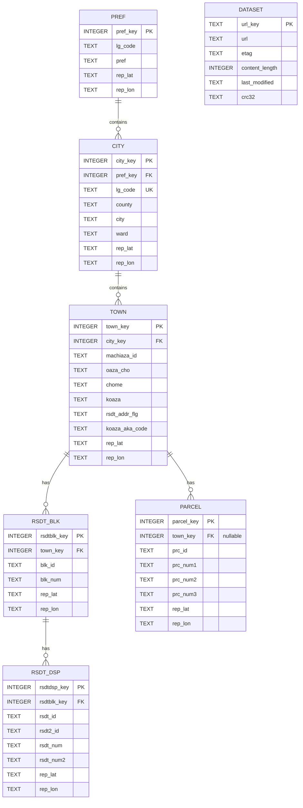

# Schema / ER 図（コードから復元）

## ER 図（Mermaid）

備考:
- 実際の CREATE TABLE は `src/drivers/database/sqlite3/download/*.ts` に定義があります（pref/city/town/rsdt_blk/rsdt_dsp/parcel）。
- `DATASET` は URL キャッシュメタを保持する論理テーブルを示します（実装は `dataset-db.ts` に準拠）。

## 主キーの生成（TableKeyProvider）

主キーは LGコードやIDを元に安定して導出されます。これにより UPSERT と参照がシンプルになります。

- pref_key = f(lg_code)
- city_key = f(lg_code)
- town_key = f(lg_code, machiaza_id)
- rsdtblk_key = f(lg_code, machiaza_id, blk_id)
- rsdtdsp_key = f(lg_code, machiaza_id, blk_id, rsdt_id, rsdt2_id)
- parcel_key = f(lg_code, machiaza_id, prc_id)

## 代表的な参照クエリ（抜粋）

- 京都通り名（pref→city→town 結合）
  - FROM pref p JOIN city c ON p.pref_key=c.pref_key JOIN town t ON c.city_key=t.city_key
  - WHERE substr(c.lg_code,1,3)='261' AND t.oaza_cho IS NOT NULL
- 町丁目一覧（pref→city→town）
  - GROUP BY (pref_key,city_key,town_key,chome)
- 街区符号（rsdt_blk）
  - WHERE town_key=@town_key AND blk_num=@blk_num
- 住居番号（rsdt_dsp）
  - WHERE rsdtblk_key=@rsdtblk_key
- 地番（parcel）
  - WHERE town_key=@town_key AND prc_id LIKE @prc_id

## インデックス（抜粋）

- CITY.lg_code UNIQUE
- RSDT_BLK: idx_rsdt_blk_town_key, idx_rsdt_blk_town_key_and_blk_num
- RSDT_DSP: idx_rsdt_dsp_rsdtblk_key
- PARCEL: idx_parcel_town_key(town_key, prc_id)

## テーブル定義（CREATE TABLE 抜粋）

各テーブルの定義は download 用ドライバに実装されています（better-sqlite3）。以下は要点の抜粋です。

- PREF（src/drivers/database/sqlite3/download/common-db-download-sqlite3.ts）
  - `pref_key INTEGER PRIMARY KEY`
  - `lg_code TEXT`, `pref TEXT`, `rep_lat TEXT`, `rep_lon TEXT`

- CITY（同上）
  - `city_key INTEGER PRIMARY KEY`, `pref_key INTEGER`
  - `lg_code TEXT UNIQUE`, `county TEXT`, `city TEXT`, `ward TEXT`
  - `rep_lat TEXT`, `rep_lon TEXT`

- TOWN（同上）
  - `town_key INTEGER PRIMARY KEY`, `city_key INTEGER`
  - `machiaza_id TEXT`, `oaza_cho TEXT`, `chome TEXT`, `koaza TEXT`
  - `rsdt_addr_flg TEXT`, `koaza_aka_code TEXT`, `crc32 TEXT`
  - `rep_lat TEXT`, `rep_lon TEXT`

- RSDT_BLK（src/drivers/database/sqlite3/download/rsdt-blk-db-download-sqlite3.ts）
  - `rsdtblk_key INTEGER PRIMARY KEY`, `town_key INTEGER`
  - `blk_id TEXT`, `blk_num TEXT`, `crc32 TEXT`
  - `rep_lat TEXT`, `rep_lon TEXT`

- RSDT_DSP（src/drivers/database/sqlite3/download/rsdt-dsp-db-download-sqlite3.ts）
  - `rsdtdsp_key INTEGER PRIMARY KEY`, `rsdtblk_key INTEGER`
  - `rsdt_id TEXT`, `rsdt2_id TEXT`, `rsdt_num TEXT`, `rsdt_num2 TEXT`, `crc32 TEXT`
  - `rep_lat TEXT`, `rep_lon TEXT`

- PARCEL（src/drivers/database/sqlite3/download/parcel-db-download-sqlite3.ts）
  - `parcel_key INTEGER PRIMARY KEY`, `town_key INTEGER DEFAULT null`
  - `prc_id TEXT`, `prc_num1 TEXT`, `prc_num2 TEXT`, `prc_num3 TEXT`, `crc32 TEXT`
  - `rep_lat TEXT`, `rep_lon TEXT`
  - INDEX: `idx_parcel_town_key (town_key, prc_id)`

注意:

- 外部キー制約（FOREIGN KEY）は明示的には定義していません（キー整合はアプリ側で担保）。
- 緯度経度は TEXT 型で格納されています（必要に応じて取り出し時に数値化）。
