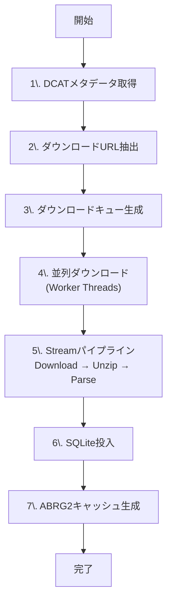
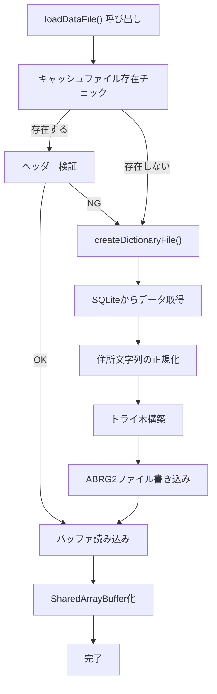

# Overview（全体像）

ABR Geocoderのダウンロード&キャッシュ生成システムは、大量のオープンデータを効率的に取得・変換するために設計されています。このページでは、全体の流れと並列処理の仕組みを詳しく説明します。

## 全体フロー



## 処理の詳細

### 1. DCATメタデータ取得

政府のオープンデータカタログ（DCAT形式）からデータセット情報を取得します。

**DCATとは？**
- Data Catalog Vocabulary（データカタログ語彙）の略
- メタデータの標準形式で、データセットの所在やメタ情報を記述
- JSON形式でデータセット一覧と配布URLを提供

**取得例**：

```typescript
// download-process.ts:88-103
const client = new HttpRequestAdapter({
  hostname: url.hostname,
  userAgent: this.container.env.userAgent,
  peerMaxConcurrentStreams: 1, // メタデータ取得は1接続で十分
});

const response = await client.getJSON({ url });
```

**レスポンス構造**：

```json
{
  "dataset": [
    {
      "description": "最終更新日: 2025-09-30T15:41:43.000Z",
      "distribution": [
        {
          "accessURL": "https://example.com/data_01.csv.zip"
        }
      ]
    }
  ]
}
```

### 2. ダウンロードURL抽出

DCAT JSONから `.csv.zip` ファイルのURLと最終更新日を抽出します。

```typescript
// download-process.ts:228-254
const downloadUrls: string[] = [];
const urlToLastModified = new Map<string, string>();

for (const dataset of dcatResponse.dataset) {
  // descriptionから最終更新日を抽出
  const match = dataset.description.match(/最終更新日:\s*(.+)/);
  if (match) {
    lastModified = match[1];
  }

  // .csv.zip のURLを収集
  for (const dist of dataset.distribution) {
    if (dist.accessURL && dist.accessURL.includes('.csv.zip')) {
      downloadUrls.push(dist.accessURL);
      urlToLastModified.set(dist.accessURL, lastModified);
    }
  }
}
```

### 3. ダウンロードキュー生成

抽出したURLを、自治体コード（LGコード）とデータセット種別でグルーピングします。

**データセット種別**：
- `pref`: 都道府県マスター
- `city`: 市区町村マスター
- `rsdtdsp_blk`: 街区レベル住所
- `rsdtdsp_rsdt`: 住居表示住所
- `parcel`: 地番

**LGコードによるフィルタリング**：

```typescript
// download-process.ts:256-291
const lgCodePackages = createPackageTree(downloadUrls);

lgCodePackages.forEach((packages, lgCode) => {
  // 都道府県コード（例: "01...." = 北海道）
  const prefix = lgCode.substring(0, 2);

  // ダウンロード対象かチェック
  if (downloadTargetLgCodes.size > 0 && !targetPrefixes.has(prefix)) {
    return; // スキップ
  }

  // ダウンロードリクエスト作成
  for (const [dataset, packageId] of packages.entries()) {
    results.push({
      kind: 'download',
      dataset,
      packageId,
      useCache: true,
      lgCode,
      lastModified: urlToLastModified.get(packageId),
    });
  }
});
```

**キューのランダム化**：

```typescript
// download-process.ts:129-132, 354
// ランダムに並び替えることで、lgCodeが分散され、
// DB書き込みのときに衝突を起こしにくくなる
requests.sort(() => Math.random() * 3 - 2);
```

これにより、同じ自治体のデータが連続して処理されることを避け、SQLiteの書き込み競合を低減します。

## 並列ダウンロードの仕組み

### なぜ並列処理が必要か？

**問題**：数百のCSV zipファイルを順次ダウンロードすると、時間がかかりすぎる

```
順次ダウンロード（300ファイル、1ファイル10秒）:
  300ファイル × 10秒 = 3000秒 = 50分
```

**解決策**：Worker Threadsで並列ダウンロード

```
並列ダウンロード（6 Workers）:
  300ファイル / 6 Workers × 10秒 ≈ 500秒 = 8分20秒

速度向上: 50分 → 8分20秒（6倍高速）
```

### Worker Threadsとは？

Node.jsの `worker_threads` モジュールを使うと、JavaScriptコードを別スレッドで実行できます。

**従来のNode.js（シングルスレッド）**：

```
メインスレッド
  ├─ ファイル1をダウンロード（10秒）
  ├─ ファイル2をダウンロード（10秒）
  ├─ ファイル3をダウンロード（10秒）
  └─ ...

問題: ダウンロード中は他の処理ができない
```

**Worker Threads利用時（マルチスレッド）**：

```
メインスレッド
  ├─ タスクキューを管理
  └─ Workerに割り振り

Worker 1 → ファイル1ダウンロード（10秒）
Worker 2 → ファイル2ダウンロード（10秒）
Worker 3 → ファイル3ダウンロード（10秒）
Worker 4 → ファイル4ダウンロード（10秒）
Worker 5 → ファイル5ダウンロード（10秒）
Worker 6 → ファイル6ダウンロード（10秒）

利点: 6倍の速度で並列処理可能
```

### Worker数の決定ロジック

```typescript
// download-process.ts:135-145
// SQLite書き込み5コアに対して、ダウンロードを1コア、
// 最大で6コアがダウンロードに割り当てる
const numOfDownloadThreads = Math.min(
  Math.max(params.numOfThreads / 5, 1),  // 全体の1/5をダウンロードに
  6  // 最大6スレッド
);

const downloadTransform = await DownloadTransform.create({
  maxConcurrency: numOfDownloadThreads,  // Worker数
  maxTasksPerWorker: params.concurrentDownloads || 1,  // 1Workerあたりの並列接続数
});
```

**考え方**：
- ダウンロードはネットワークI/O待ちが多い（CPU負荷は低い）
- CSV解析とDB書き込みはCPU集約的（計算負荷が高い）
- そのため、ダウンロードWorkerは少なめ（最大6）、DB書き込みWorkerは多め（残りのコア）

**例**：CPUコア数が12の場合

```
総スレッド数: 12
ダウンロードWorker: 12 / 5 = 2.4 → 2 Workers
CSV/DB Worker: 12 - 2 = 10 Workers
```

### HTTPS接続プールによる並列接続

各ダウンロードWorkerは、複数のHTTPS接続を同時に使えます。

**HTTP/1.1の制限**：
- 1つの接続で1リクエストずつ処理（順次）
- 同じサーバーへの並列リクエストには複数の接続が必要

**接続プールとは？**：
- 複数のHTTPS接続を事前に確保し、再利用する仕組み
- `https.Agent` の `keepAlive` オプションで有効化
- `maxSockets` で同時接続数を制御

```typescript
// src/interface/http-request-adapter.ts:99
this.agent = new https.Agent({
  keepAlive: true,  // 接続を再利用
  maxSockets: options.peerMaxConcurrentStreams,  // 同時接続数
});
```

**具体例**：

```typescript
// download-worker.ts:47
peerMaxConcurrentStreams: params.initData.maxTasksPerWorker,
```

```
Worker 1（maxSockets = 10）:
  接続1 → file1.csv.zip ダウンロード中
  接続2 → file2.csv.zip ダウンロード中
  接続3 → file3.csv.zip ダウンロード中
  ...
  接続10 → file10.csv.zip ダウンロード中

利点: 1つのWorkerで10ファイルを並列ダウンロード
```

### HTTP/2との違い

**HTTP/2の多重化（multiplexing）**：
- 1つのTCP接続で複数のリクエストを同時処理
- ストリーム単位で並列化

**ABR Geocoderのアプローチ**：
- HTTP/1.1 + 接続プール
- 複数のTCP接続で並列化

```
HTTP/2 (未使用):
  1つの接続 → [Stream1][Stream2][Stream3]...

ABR Geocoder (HTTP/1.1 + 接続プール):
  接続1 → リクエスト1
  接続2 → リクエスト2
  接続3 → リクエスト3
  ...
```

**なぜHTTP/2を使わないのか？**：
- Node.jsの `http2` モジュールはAPIが複雑
- 接続プールで十分な並列性が得られる
- サーバー側がHTTP/2に対応していない場合がある

## Streamパイプライン処理

ダウンロードしたzipファイルは、メモリに全て読み込まず、Streamで処理します。

### Stream処理とは？

**従来の方法（バッファ全読み込み）**：

```javascript
// ❌ メモリを大量に消費
const data = await fs.readFile('huge-file.csv.zip'); // 100MB全読み込み
const unzipped = await unzip(data); // さらに200MBメモリ使用
const parsed = parseCSV(unzipped);
await insertDB(parsed);

問題: 100MB × 300ファイル = 30GB必要！
```

**Stream方式（逐次処理）**：

```javascript
// ✅ メモリ効率的
downloadStream
  .pipe(unzipStream)    // 読み込みながら解凍
  .pipe(csvParseStream) // 解凍しながらパース
  .pipe(dbInsertStream) // パースしながらDB投入

利点: 常に数MB程度のメモリで処理可能
```

### パイプライン構成

```typescript
// download-process.ts:182-194
await pipeline(
  srcStream,                  // ダウンロードリクエストのストリーム
  downloadTransform,          // HTTPダウンロード + unzip
  csvParseTransform,          // CSVパース + DB投入
  saveResourceInfoTransform,  // メタデータ保存
  dst,                        // 完了カウント
);
```

**各段階の詳細**：

#### 1. DownloadTransform

```
入力: DownloadRequest { dataset, packageId, lgCode, ... }
処理: HTTPダウンロード + zip解凍
出力: { zipBuffer: Buffer, request: DownloadRequest }
```

```typescript
// transformations/download-transform.ts
class DownloadTransform extends Transform {
  async _transform(request: DownloadRequest, encoding, callback) {
    // WorkerThreadPoolにタスクを投入
    const result = await this.pool.run({
      action: 'download',
      url: request.packageId,
      useCache: request.useCache,
    });

    callback(null, { zipBuffer: result.buffer, request });
  }
}
```

#### 2. CsvParseTransform

```
入力: { zipBuffer: Buffer, request: DownloadRequest }
処理: zipからCSV抽出 → パース → DB投入
出力: DownloadResult { lgCode, dataset, recordCount }
```

```typescript
// transformations/csv-parse-transform.ts
class CsvParseTransform extends Transform {
  async _transform(data, encoding, callback) {
    // WorkerThreadPoolでCSVパースとDB投入を並列実行
    const result = await this.pool.run({
      action: 'parse',
      zipBuffer: data.zipBuffer,
      dataset: data.request.dataset,
      lgCode: data.request.lgCode,
    });

    callback(null, result);
  }
}
```

**セマフォによる競合制御**：

```typescript
// download-process.ts:153-156
semaphoreSize: 101,  // 101個のセマフォでDB書き込みを分散
```

複数のWorkerが同時にSQLiteに書き込むと競合が発生します。セマフォで排他制御しつつ、101個のスロットに分散することで、適度な並列性を維持します。

```
Worker 1 → セマフォ#0 取得 → DB書き込み → 解放
Worker 2 → セマフォ#1 取得 → DB書き込み → 解放
Worker 3 → セマフォ#2 取得 → DB書き込み → 解放
...
Worker 102 → セマフォ#0 待機（Worker 1が解放するまで）
```

#### 3. SaveResourceInfoTransform

```
入力: DownloadResult
処理: ダウンロード済みファイルのETagとURLをDBに保存
出力: DownloadResult（そのまま）
```

**ETagによる差分更新**：

```typescript
// transformations/save-resource-info-transform.ts
if (existingETag === newETag) {
  // ファイルが更新されていないのでスキップ
  return callback();
}

// 更新されているので再ダウンロード
await download(url);
```

## ABRG2キャッシュ生成

SQLiteへのデータ投入が完了したら、検索に最適化されたABRG2キャッシュファイルを生成します。

### キャッシュファイルの種類

| ファイル名パターン | スコープ | 内容 |
|-------------------|---------|------|
| `pref_<hash>.abrg2` | 全国（単一） | 都道府県一覧 |
| `county-and-city_<hash>.abrg2` | 全国（単一） | 郡+市 |
| `city-and-ward_<hash>.abrg2` | 全国（単一） | 市+区 |
| `oaza-cho_<hash>_<LG>.abrg2` | 自治体別 | 大字+丁目+小字 |
| `ward_<hash>.abrg2` | 全国（単一） | 区 |
| `tokyo23-ward_<hash>.abrg2` | 全国（単一） | 東京23区 |

**`<hash>` の役割**：
- SQL生成式に対するCRC32ハッシュ値
- SQL文を変更すると、ハッシュ値が変わり、キャッシュが自動的に再生成される

### キャッシュ生成のタイミング

```typescript
// download-process.ts:110-120
const createDictionaryFileFunctions = [
  PrefTrieFinder.loadDataFile,
  CountyAndCityTrieFinder.loadDataFile,
  CityAndWardTrieFinder.loadDataFile,
  KyotoStreetTrieFinder.loadDataFile,
  OazaChoTrieFinder.loadDataFile,
  WardAndOazaTrieFinder.loadDataFile,
  WardTrieFinder.loadDataFile,
  Tokyo23WardTrieFinder.loadDataFile,
  Tokyo23TownTrieFinder.loadDataFile,
];
```

全てのダウンロードとDB投入が完了した後、各Finderの `loadDataFile()` が呼ばれます。

### キャッシュ生成プロセス



**ステップ詳細**：

#### 1. キャッシュファイル存在チェック

```typescript
// models/trie/trie-finder2.ts
const cacheFiles = await fs.readdir(cacheDir);
const pattern = new RegExp(`^${this.cacheBaseName}_.*\\.abrg2$`);
const existing = cacheFiles.filter(file => pattern.test(file));

if (existing.length > 0) {
  // キャッシュが存在する場合
  const buffer = await fs.readFile(path.join(cacheDir, existing[0]));

  // ヘッダー検証（先頭100バイト）
  if (this.verifyHeader(buffer)) {
    return buffer; // キャッシュを使用
  }
}

// キャッシュが無い、または破損している場合は再生成
await this.createDictionaryFile();
```

#### 2. SQLiteからデータ取得

```typescript
// 例: pref-trie-finder.ts
const rows = db.prepare(`
  SELECT DISTINCT
    pref_name,
    pref_name_kana,
    pref_name_roma,
    lg_code
  FROM pref
  ORDER BY lg_code
`).all();
```

#### 3. 住所文字列の正規化

```typescript
for (const row of rows) {
  // 正規化処理
  const normalized = normalizeAddress(row.pref_name);
  // 全角 → 半角
  // 漢数字 → 算用数字
  // 異体字 → 標準字
  // カタカナ → ひらがな
}
```

#### 4. トライ木構築

```typescript
const writer = new FileTrieWriter(outputPath);

for (const row of rows) {
  const key = normalizeAddress(row.pref_name); // 例: "東京都"
  const value = {
    pref_name: row.pref_name,
    pref_name_kana: row.pref_name_kana,
    lg_code: row.lg_code,
  };

  writer.addNode(key, value);
}

await writer.close(); // ファイルにフラッシュ
```

**トライ木の構造**：

```
(root)
 ├─ 東
 │  └─ 京
 │     └─ 都 → {"pref_name":"東京都","lg_code":"130001"}
 ├─ 大
 │  └─ 阪
 │     └─ 府 → {"pref_name":"大阪府","lg_code":"270008"}
 └─ 京
    └─ 都 → {"pref_name":"京都府","lg_code":"260002"}
```

詳細は [Geocoding > Strategy](../geocoding/strategy.md) を参照してください。

#### 5. ABRG2ファイル書き込み

```typescript
// file-trie-writer.ts
class FileTrieWriter {
  async close() {
    // ヘッダー書き込み
    this.writeHeader();

    // トライノード書き込み（再帰）
    this.writeTrieNode(this.rootNode);

    // データノード書き込み（ハッシュ連結リスト）
    this.writeDataNodes();

    // ファイルに出力
    await fs.writeFile(this.outputPath, this.buffer);
  }
}
```

**ABRG2フォーマット**：

```
[Header]
- magic: "abrg" (4 bytes)
- version: 2.2 (2 bytes)
- trie_root: offset (4 bytes)
- data_head: offset (4 bytes)

[Trie Nodes]
- size (1B) + sibling (4B) + child (4B) + hash_list (4B) + name (var)

[Data Nodes]
- next (4B) + size (2B) + hash (8B) + data (gzip JSON)
```

詳細は [Geocoding > ABRG2 Format](../geocoding/abrg2-format.md) を参照してください。

#### 6. SharedArrayBuffer化

```typescript
// models/trie/trie-finder2.ts
const fileBuffer = await fs.readFile(cachePath);

// SharedArrayBufferにコピー
const sharedBuffer = new SharedArrayBuffer(fileBuffer.length);
const view = new Uint8Array(sharedBuffer);
view.set(fileBuffer);

// 各Workerに共有（コピーせずポインタだけ渡す）
workers.forEach(worker => {
  worker.postMessage({ trieBuffer: sharedBuffer });
});
```

**SharedArrayBufferの利点**：

```
通常のコピー方式:
  メインスレッド: 50MB
  Worker 1: 50MB（コピー）
  Worker 2: 50MB（コピー）
  Worker 3: 50MB（コピー）
  合計: 200MB

SharedArrayBuffer:
  共有メモリ: 50MB
  Worker 1: 参照のみ
  Worker 2: 参照のみ
  Worker 3: 参照のみ
  合計: 50MB
```

詳細は [Geocoding > Parallelism](../geocoding/parallelism.md) を参照してください。

## パフォーマンス最適化

### 1. ダウンロード並列化

```
最適なWorker数 = CPU並列数 / 5（最大6）
最適な接続数 = ダウンロード並列数

例: 12コアCPU、並列ダウンロード数10
  ダウンロードWorker: 12/5 = 2
  各Workerの接続数: 10
  合計並列ダウンロード: 2 × 10 = 20ファイル同時
```

### 2. DB書き込み分散

```
ランダムキュー + 101個のセマフォ
→ 同じ自治体への書き込み競合を低減
→ デッドロックを回避
```

### 3. Stream処理

```
メモリ使用量: 各Worker数MB程度
→ 300ファイル × 100MBでも安定動作
```

### 4. ETagキャッシュ

```
前回ダウンロード時のETagを保存
→ 更新されていないファイルはスキップ
→ 差分更新で高速化
```

## コントリビューションのヒント

### ダウンロード速度の改善

- **HTTP/2対応**: `http2` モジュールを使った実装
- **圧縮転送**: `Accept-Encoding: gzip, br` の活用
- **CDN活用**: データソースがCDN対応している場合の最適化

### キャッシュ生成の最適化

- **並列生成**: 複数のFinderを並列実行
- **インクリメンタル更新**: 差分だけトライ木を更新
- **圧縮アルゴリズム**: gzipよりbrotliやzstdで高圧縮

### エラーハンドリング強化

- **リトライロジック**: ネットワークエラー時の再試行
- **チェックサム検証**: ダウンロードしたファイルの整合性確認
- **ロールバック機能**: DB投入失敗時の自動ロールバック

### モニタリング機能

- **進捗表示**: ダウンロード速度、残り時間の推定
- **統計情報**: Worker別の処理件数、平均速度
- **ボトルネック検出**: どのWorkerが遅いか可視化

このDownload & Cacheシステムにより、大量のオープンデータを効率的に取得・変換し、高速なジオコーディングを実現しています！
