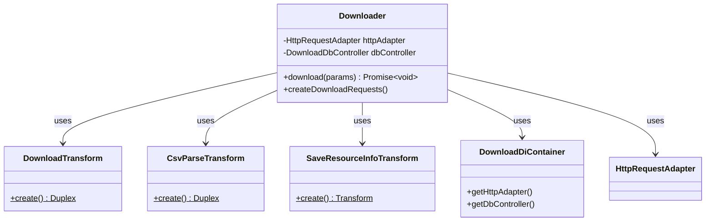

# Download

この章では、DCAT からの取得、CSV パース、SQLite 取込、および辞書生成への接続について解説します。

## Download System（ダウンロードシステム）

データセットのダウンロードと処理を担当します。

**役割:**
- **Downloader**: データセットダウンロード処理のオーケストレーター
- **DownloadTransform**: HTTPダウンロードストリーム変換。並列ダウンロード管理
- **CsvParseTransform**: CSVファイル解析とDB保存ストリーム変換
- **SaveResourceInfoTransform**: ダウンロード済みリソースのメタ情報（ETag等）をDB保存
- **DownloadDiContainer**: ダウンロード処理用の依存性注入コンテナ
