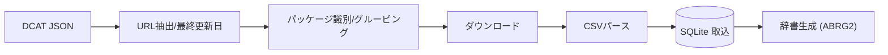

# Download Pipeline

目的: DCAT の配布一覧から CSV/zip を取得し、SQLite へ投入して辞書生成の基礎を作る。

要点:

- DCAT から `.csv.zip` を抽出し、LGコード×データセット種別にグルーピング
- キューを分散させて DB 書込競合を低減（ランダム化）
- 取込後に各 Finder の `createDictionaryFile` が走り、キャッシュを生成

