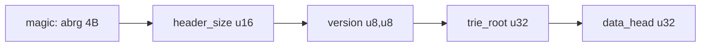
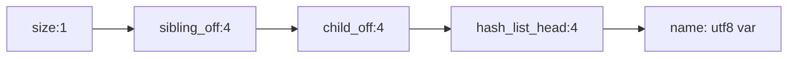
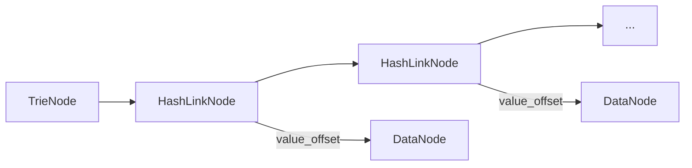
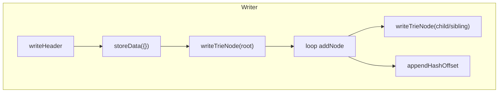

# ABRG2 File Format（辞書バイナリ仕様）

ABRG2 は、検索キー（正規化後の文字列）をトライ木で保持し、各ノードから圧縮済み値（JSON）へのハッシュ連結リストを参照する構造です。全体は Big Endian で整列し、オフセットは 4 バイト固定です。

## ヘッダー

- マジック: `abrg`（ASCII 4B）
- ヘッダーサイズ: `u16`（2B）
- バージョン: `major(u8), minor(u8)`（2B）
- トライ木先頭オフセット: `u32`（4B）
- データ領域先頭オフセット: `u32`（4B）

- バージョンは `2.2` 以上をサポート（現行 2.2.x）。異なる場合は `readHeader()` で非対応扱い。

## トライ木ノード

- 構成: `size(u8)` + `sibling(u32)` + `child(u32)` + `hash_list_head(u32)` + `name(utf8)`
- `size` はノード全体長（1B; 実装上 255B までの想定）
- `name` は当該ノードが表す一文字（UTF-8 可変長）

- 兄弟/子オフセットは 0 のとき未設定
- `hash_list_head` は「このノードに結びつくデータノードのオフセット」を連結リストで保持するための先頭ノード位置

## ハッシュ連結リスト（ノード側）

- ノード → [HashLinkNode]* → データノード
- HashLinkNode 構造: `next(u32)` + `value_offset(u32)`
- `value_offset` はデータノード（下記）の先頭アドレス

## データノード

- 連結リスト: `next(u32)` + `size(u16)` + `hash(u64)` + `data(bytes)`
- `data` は `gzip(JSON.stringify(value) を json-stable-stringify で安定化)` のバイト列
- `hash` は FNV-1a 64bit を `data`（=圧縮済みバイト）に対して計算
- 同一ハッシュ衝突時は `next` で連結し、読み出し側で同一ハッシュを辿る

重複排除と衝突処理（Writer 側）:

- 既知ハッシュがある場合、連結を辿って `data` バイト列比較で完全一致すれば再利用（追記しない）
- 一致しなければ最終ノードの `next` に新規ノードを追加
- 初回はヘッダーの `data_head` から連結を形成

## 生成フロー（FileTrieWriter）

1) ヘッダー書込（`abrg`, version, エントリポイント）
2) 空のルートデータ `{}` を保存（オフセット 0 のキー）
3) ルート Trie ノード（空文字）を保存し、ヘッダーのエントリポイントを更新
4) 各エントリについて `addNode(key, value)` を実行
   - キー文字列を先頭から子へ、未存在ならノードを追記
   - 末端/中間いずれでも値がある箇所で `hash_list` 末尾にオフセットを追加

## 読み出し（TrieAddressFinder2）

- 先頭 6B 読み出し→ヘッダー検証→全体ヘッダー取得
- 探索は `readTrieNode(offset)` でノードをデコードし、`sibling/child` を辿りながら一致/あいまい一致/補助チャレンジを分岐
- 一致ノードからハッシュ連結を辿り、`readDataNode()` で `data` を解凍・JSON へ復元

パフォーマンス考慮:

- Writer は内部バッファ（8MB）で追記をバッファリング、前方書換（子/兄弟オフセット更新）は直接書込
- 検索側はメモリ上の Buffer を直接参照（I/O 無し）

互換性:

- バージョンやオフセットサイズ、エンディアンはヘッダー/定数に固定
- 破損時は `magic`/`version`/`size` チェックで弾く

