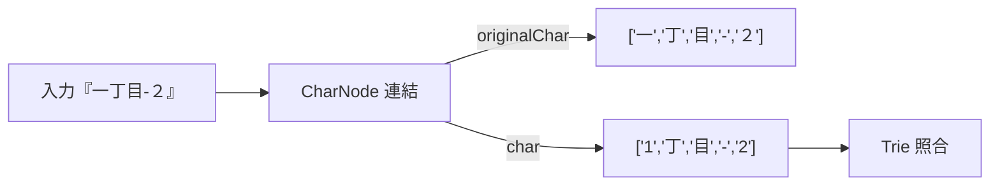

# あいまい検索（Fuzzy Search）

本プロジェクトでは、入力文字列を1文字ごとのノード列に分解し（`CharNode`）、各ノードが

- `originalChar`: 入力の元文字（例: 全角の「１」、漢数字「一」など）
- `char`: 正規化後の比較用文字（例: 半角の「1」）

を同時に保持します。これにより、Trie への照合は正規化後の `char` で行いつつ、結果出力やデバッグでは `originalChar` を復元して表示できます。



## 文字列の分解と複製

`CharNode` は単方向リスト構造です。探索時に枝分かれ（兄弟・ワイルドカード・追加チャレンジ）が発生するため、現在の探索状態（未消化の文字列・一致パス）を安全に保持するために随所で `.clone()` を使って複製します。

Trie 探索（`TrieAddressFinder2`）では次のような分岐が行われます。

- 兄弟ノードへ進むとき: ターゲット（探索対象）やパスを `.clone()` して別分岐としてキューへ追加
- `fuzzy`（ワイルドカード）で一致させるとき: 現在の文字を曖昧一致として分岐し、`ambiguousCnt` を加算
- `extraChallenges`（前置語などの補助チャレンジ）: 追加した文字列＋残りのターゲットを連結して新たな探索としてキューへ追加

擬似コード（概念）:

```text
if target.char != node.name:
  if node.sibling:
    enqueue({ target: target.clone(), offset: node.sibling, path: path.clone() })
  if target.char == fuzzy:
    // ワイルドカード: 一致「したこと」にする分岐
    enqueue({... ambiguousCnt: ambiguousCnt + 1 })
  if allowExtraChallenge:
    for word in extraChallenges:
      if word[0] == node.name:
        enqueue({ target: (word + target).clone(), offset, allowExtraChallenge: false })
  continue
```

## あいまい度（ambiguousCnt）とスコア

曖昧一致（`fuzzy` や追加チャレンジ）を使った分岐は、`ambiguousCnt` を増やします。最終スコア計算（`GeocodeResultTransform`）では、

- マッチレベル（都道府県/市/町/街区/地番）
- 文字一致率（入力長に対する一致割合）
- あいまい度（ambiguousCnt）
- 表記差のペナルティ など

を総合して最良候補を選定します。これにより、多少曖昧にしても上位候補には入るが、完全一致があればそちらが優先される挙動になります。

## 出力時の復元

正規化のために内部的に置換した記号や `fuzzy` 文字は、結果整形段階で可能な限り元に戻します（`restoreCharNode()`）。

- `DEFAULT_FUZZY_CHAR` を元の `fuzzy` 入力に戻す
- 内部記号（例: `DASH`/`SPACE`）を人間可読の形へ再置換
- 建物名や号など、先頭/末尾の省略可能記号の整形

これにより、検索の都合で内部表現を変えつつも、出力は自然な文字列になります。

## まとめ

- `CharNode` が「元の文字」と「比較用の文字」を併存させることで、正規化と復元を両立
- 分岐探索では `.clone()` により状態を安全に分岐
- `fuzzy`/`extraChallenges` による曖昧一致は `ambiguousCnt` を通じてスコアに反映

