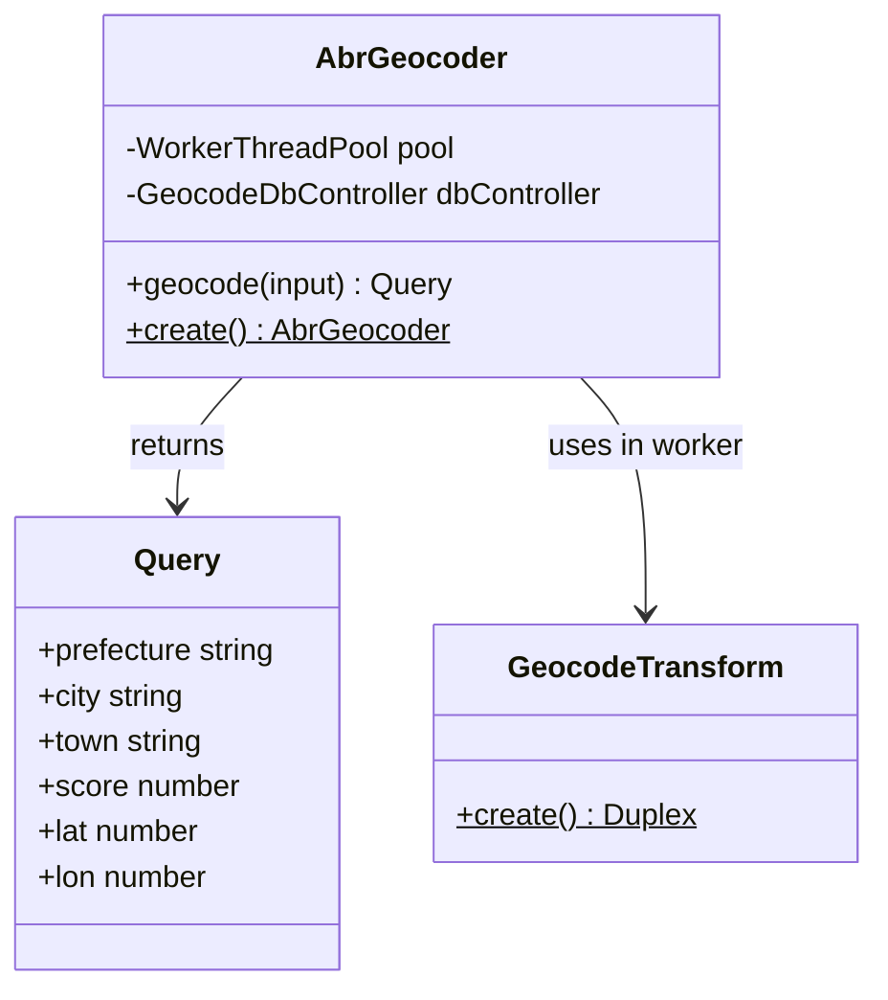
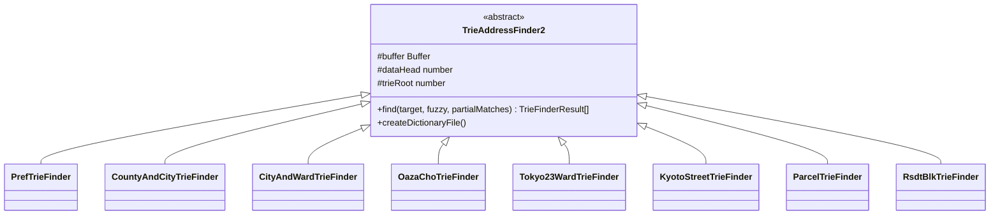
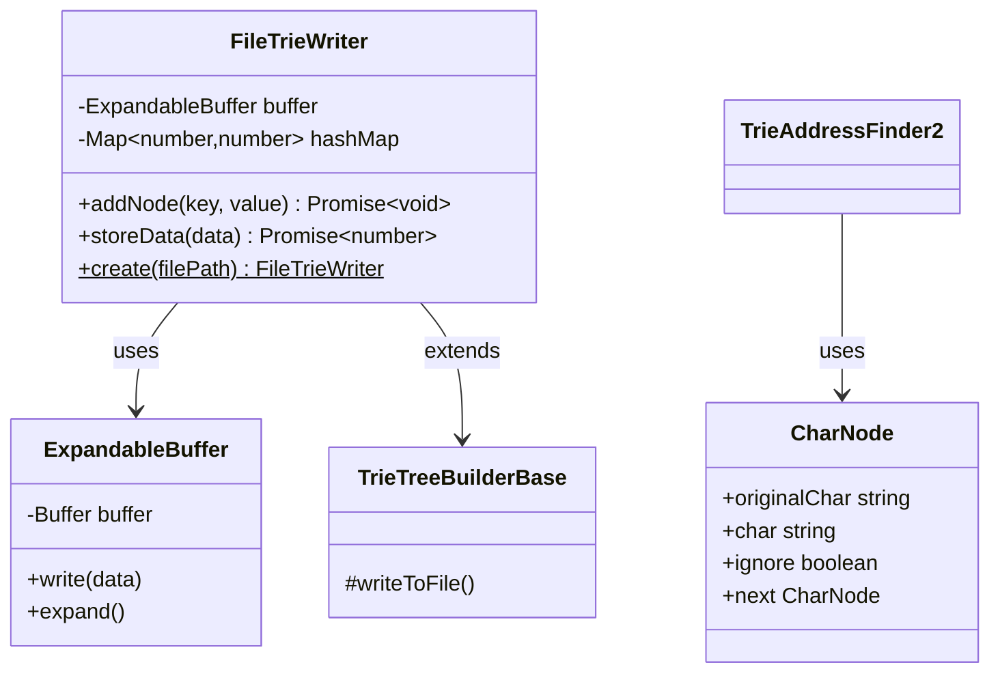

# Geocoding

この章では、探索戦略・並列処理・ABRG2 仕様・Finder 実装について解説します。

- Strategy: トライ木を用いた段階的探索とスコアリング
- Parallelism: ワーカープール/共有メモリ/順序維持
- ABRG2 Format: 辞書のバイナリ仕様
- Finder Internals: 読み出しと探索アルゴリズム
- Fuzzy Search: あいまい検索の仕組み（CharNode の複製/ambiguousCnt/復元）
 - Kyoto Streets: 京都の通り名（DBの取り扱いとキー投入・代表点補完）

## Geocoding Core（ジオコーディング中核）

ジオコーディング処理を担当する主要クラス群です。

**役割:**
- **AbrGeocoder**: ジオコーディングのメインエントリポイント。ワーカースレッドプールを管理し、入力住所をジオコード結果に変換
- **Query**: ジオコード結果を表現するデータモデル（都道府県、市区町村、緯度経度、スコア等）
- **GeocodeTransform**: ワーカースレッド内で動作するストリーム処理。複数の変換ステップをパイプライン化

## Trie Finder（トライ木検索）

各レベルの住所データを検索するトライ木ファインダー群です。

**役割:**
- **TrieAddressFinder2**: トライ木検索の基底クラス。バッファベースの高速検索を実装
- **PrefTrieFinder**: 都道府県データ用
- **CountyAndCityTrieFinder**: 郡市データ用
- **CityAndWardTrieFinder**: 市区データ用
- **OazaChoTrieFinder**: 大字町丁目データ用
- **Tokyo23WardTrieFinder**: 東京23区特別処理用
- **KyotoStreetTrieFinder**: 京都通り名データ用
- **ParcelTrieFinder**: 地番データ用
- **RsdtBlkTrieFinder**: 住居表示（街区符号）データ用

## Data Structures（データ構造）

トライ木の構築と永続化を担当するクラス群です。

**役割:**
- **FileTrieWriter**: バイナリトライ木（ABRG2形式）をファイルに永続化。ハッシュ値ベースのデータ重複排除
- **CharNode**: ジオコーディング検索時の文字ノード。連結リスト構造で文字列を管理
- **ExpandableBuffer**: 動的に拡張可能なバッファ。トライ木ノード管理時に使用
- **TrieTreeBuilderBase**: トライ木構築の基底クラス
