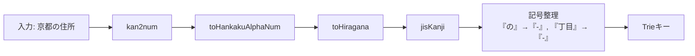
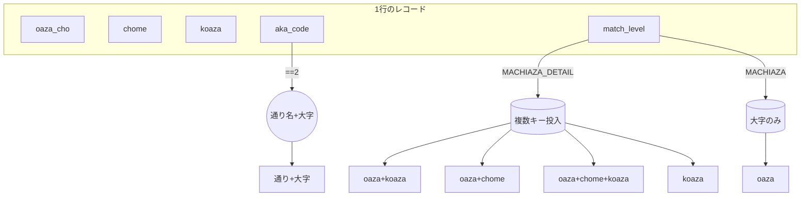

# 京都の通り名（DBの取り扱いと探索）

本ソフトウェア v2.2 では、京都市に特有の「通り名 + 大字/丁目/小字」の表記揺れに対応するため、DBからの行の取り扱いと Trie への投入ルールを見直しています。

## ポイント（実装に即した要約）

- データ取得は `getKyotoStreetRows()`（`CommonDbGeocodeSqlite3`）
  - `town` と `city` を結合し、京都市（LGコード先頭が`261`）のみ抽出
  - 代表点が欠落するレコードは、同一 `machiaza_id` の上位（4桁）を代表とみなして緯度経度を補完
  - `match_level` と `coordinate_level` をレコードごとに設定（町字 or 町字詳細）
- Trie 生成は `KyotoStreetTrieFinder.createDictionaryFile()`
  - `koaza_aka_code === 2` のときは「通り名 + 大字」をキー化（通称扱い）
  - それ以外は、用途に応じて複数キーを投入
    - 小字のみ: `(koaza)`
    - 大字+小字: `(oaza_cho + koaza)`
    - 大字+丁目: `(oaza_cho + chome)`
    - 大字+丁目+小字: `(oaza_cho + chome + koaza)`
  - 町字のみ（`match_level=MACHIAZA`）の行は「通り名がヒットしない場合の後方互換」として、大字のみ `(oaza_cho)` を投入

## 正規化（Kyoto 向けの追加）

`KyotoStreetTrieFinder.normalize()` では、以下の正規化を行います。

- 漢数字→算用数字（`kan2num`）
- 全角英数字→半角（`toHankakuAlphaNum`）
- 片/半角カナ→ひらがな、および地名ゆれの統一（`toHiragana` + 部分特例）
- 旧字→新字/JIS第2→第1（`jisKanji`）
- 「の」→ダッシュ（`-`）変換（数字の連結として現れる場合）
- 「丁目」→ダッシュ（`-`）
- 先頭/末尾の余分な空白/ダッシュの除去

備考:
- コメントにある「1丁目上る/下る/東入/西入 の省略補完」は現状無効化（コメントアウト）です。必要に応じて将来の拡張で復帰可能な構造にしています。

## 代表点の扱い（補完ロジック）

`getKyotoStreetRows()` 内では、`rep_lat/rep_lon` が欠落している行に対して、同一 `city_key` の `machiaza_id` 上位4桁（末尾`000`）の代表点で補完します。

- 例: `machiaza_id=XXXXYYY` で YYY≠`000` かつ代表点がない → `XXXX000` の代表点を採用し、`coordinate_level` を町字レベルに下げる

これにより、通り名のみの行や細粒度の行でも、最低限の座標が返せるようにしています。

## 検索キーの多面化（入力表記に強く）

京都では、利用者の入力が「通り名中心」だったり「大字中心」だったり揺れます。そこで1レコードから複数のキーを投入して、入力の多様性に耐えるようにしています。

- 通称（`koaza_aka_code===2`）: `(通り名 + 大字)` で直接ヒットさせる
- 詳細（`MACHIAZA_DETAIL`）: `(小字)`, `(大字+小字)`, `(大字+丁目)`, `(大字+丁目+小字)`
- 町字（`MACHIAZA`）: `(大字)` だけでもヒット

## ユーザーへの挙動（検索時）

- 住所に「条」「丁目」「の」などが混在していても、正規化後に同一キーへ寄せます
- 通り名だけでも候補が出ます（`aka_code===2` のケース）
- 代表点がない詳細行は、上位の町字代表点で代替することがあります（結果の `coordinate_level` が下がる）

## 変更の背景（v2.2仕様の要旨）

- 通り名を含むレコードの表現・検索を強化（通称の取り扱いと複数キー投入）
- 代表点の欠落を上位N字（`machiaza_id`）の代表点で補完（地理的に大きく外れない範囲の近似）
- 京都特有の記法（「の」「丁目」「条」など）を単純な連結に正規化し、Trieでの一致性を向上

以上により、京都の住所入力に対しても、従来より頑健にヒットするよう改善されています。

## 具体例（入力→正規化→キー→ヒット例）

例1: 通り名のみ（通称扱い）

- 入力: 「寺町通下る」
- 正規化: 「寺町通-下る」
- 生成キー（候補）:
  - 通り名のみは原則キー化しないが、`aka_code===2` の通称行があれば `(通り+大字)` でヒットを狙う
- 挙動: 大字が未入力のため候補は弱いが、通称の組合せで候補が出る場合がある

例2: 大字+通り名（通称: aka_code===2）

- 入力: 「室町通烏丸 通り周辺」（例）
- 正規化: 「室町-烏丸」相当の連結（「の」は`-`へ）
- 生成キー: `(通り名 + 大字)`
- 挙動: 通称行が存在する場合に最短でヒット

例3: 大字+丁目+小字

- 入力: 「四条通一丁目上る 小字〇〇」
- 正規化:
  - 「一」→「1」, 「丁目」→「-」, 「の」→「-」
  - 例: 「四条通-1-上る-〇〇」 → （内部的には `oaza_cho`/`chome`/`koaza` で連結）
- 生成キー:
  - `(oaza_cho + chome)`
  - `(oaza_cho + chome + koaza)`
- 挙動: 丁目や小字の有無に応じて、より詳細な候補が優先される

例4: 代表点欠落の補完

- 入力: 「河原町通二条下る」
- 正規化: 「河原町-2-下る」
- 生成キー: `(oaza_cho + chome)` など
- 挙動: 行に代表点が無い場合でも、同一 `machiaza_id` 上位4桁の代表点を採用し、町字レベルとして座標を返す

ヒント:

- 「の」「條/条」「丁目」などの語は連結子として`-`に寄せられます
- 全角/半角・漢数字/算用数字・仮名の揺れは正規化段で解消されます
- 通称（`aka_code===2`）が存在すれば「通り+大字」のキーが投入され、通り名中心の入力でもヒットしやすくなります
