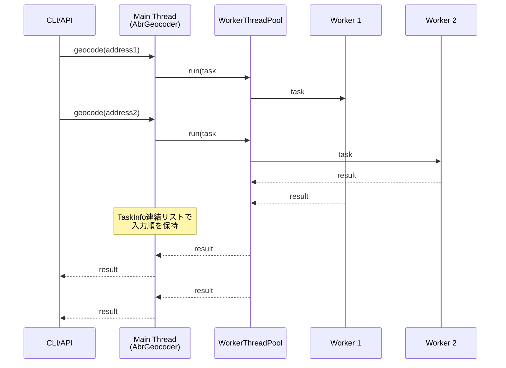

# Parallelism（並列処理とタスク整列）

ABR Geocoderは、Node.jsのWorker Threadsを活用して高速な並列ジオコーディングを実現しています。このページでは、なぜ並列処理が必要か、どのように実装されているかを詳しく説明します。

## なぜ並列処理が必要か？

### シングルスレッドの限界

Node.jsはシングルスレッドで動作するため、1つの処理が完了するまで次の処理を開始できません。

**例**：1万件の住所をジオコーディングする場合（1件あたり10ms）

```
シングルスレッド:
  件数: 10,000件
  1件あたり: 10ms
  合計時間: 10,000 × 10ms = 100,000ms = 100秒
```

### マルチスレッドの威力

4コアCPUでWorker Threadsを使うと、4倍の速度で処理できます。

```
マルチスレッド（4 Workers）:
  件数: 10,000件
  1件あたり: 10ms
  合計時間: 10,000 / 4 × 10ms = 25,000ms = 25秒

速度向上: 100秒 → 25秒（4倍高速）
```

実際には、オーバーヘッド（タスク分配、結果収集等）があるため、理論値の3〜3.5倍程度の速度向上が見込めます。

## Worker Threadsとは？

Node.jsの`worker_threads`モジュールを使うと、JavaScriptコードを別スレッドで実行できます。

### 従来のNode.js（シングルスレッド）

```
メインスレッド
  ├─ HTTPリクエスト受信
  ├─ ジオコーディング処理（重い！）
  ├─ ジオコーディング処理（重い！）
  └─ HTTPレスポンス返却

問題: 処理中は他のリクエストを受け付けられない
```

### Worker Threads利用時（マルチスレッド）

```
メインスレッド
  ├─ HTTPリクエスト受信
  ├─ タスクをWorkerに投げる（軽い）
  └─ HTTPレスポンス返却

Worker 1 → ジオコーディング処理
Worker 2 → ジオコーディング処理
Worker 3 → ジオコーディング処理
Worker 4 → ジオコーディング処理

利点: メインスレッドはブロックされず、複数リクエストを並列処理
```

## ABR Geocoderの並列処理アーキテクチャ

### 全体像



### 処理の流れ（具体例）

**入力**：3つの住所を連続で投入

```
1. 「東京都千代田区霞が関1-1-1」
2. 「大阪府大阪市中央区大手前1-1-1」
3. 「愛知県名古屋市中区三の丸3-1-2」
```

**ステップ1：タスク投入**

```
メインスレッド:
  task#1 → Worker 1に割り当て
  task#2 → Worker 2に割り当て
  task#3 → Worker 1に割り当て（空きができたら）

TaskInfo連結リスト:
  [task#1] → [task#2] → [task#3] → null
```

**ステップ2：並列実行**

```
Worker 1:
  task#1: 「東京都千代田区霞が関1-1-1」を処理中...
  ↓
  12ms後に完了

Worker 2:
  task#2: 「大阪府大阪市中央区大手前1-1-1」を処理中...
  ↓
  8ms後に完了（先に完了！）
```

**ステップ3：結果の整列**

Worker 2が先に完了しましたが、入力順（task#1 → task#2）を保つため、task#1の完了を待ちます。

```
TaskInfo連結リスト:
  [task#1: 完了待ち] → [task#2: 完了済み] → [task#3: 処理中]
                        ↑
                        結果は保持されているが、
                        task#1が完了するまで返却しない
```

**ステップ4：入力順に返却**

```
12ms時点:
  task#1が完了 → すぐに返却
  task#2も完了済み → 続けて返却

TaskInfo連結リスト:
  [task#1: 返却済み] → [task#2: 返却済み] → [task#3: 処理中]
```

## SharedArrayBuffer：メモリ共有の仕組み

### 通常のデータ受け渡し（コピー方式）

Workerにデータを渡す際、通常はシリアライゼーション（コピー）が必要です。

```javascript
// メインスレッド
const largeData = new Uint8Array(100_000_000); // 100MB
worker.postMessage(largeData); // 100MBをコピー（遅い！）

問題:
  - コピーに時間がかかる（100MBなら数百ms）
  - メモリが2倍必要（メイン100MB + Worker100MB）
```

### SharedArrayBuffer（共有方式）

SharedArrayBufferを使うと、コピーせずにメモリを共有できます。

```javascript
// メインスレッド
const sharedBuffer = new SharedArrayBuffer(100_000_000); // 100MB
worker.postMessage(sharedBuffer); // ポインタだけを渡す（一瞬！）

// Workerスレッド
onmessage = (e) => {
  const buffer = e.data; // 同じメモリ領域を参照
  const view = new Uint8Array(buffer);
  // コピーなしで直接アクセス可能
};

利点:
  - 転送時間ほぼゼロ
  - メモリ使用量は1つ分のみ
```

### ABR Geocoderでの活用

```javascript
// メインスレッド（起動時）
const trieBuffer = fs.readFileSync('pref-trie.abrg2'); // 50MB
const sharedBuffer = new SharedArrayBuffer(trieBuffer.length);
const view = new Uint8Array(sharedBuffer);
view.set(trieBuffer); // SharedArrayBufferにコピー

// 各Workerに共有
workers.forEach(worker => {
  worker.postMessage({ trieBuffer: sharedBuffer }); // 一瞬で転送
});

// Worker側
onmessage = (e) => {
  const buffer = e.data.trieBuffer;
  const finder = new TrieAddressFinder2(buffer); // コピーなしで使用
};

結果:
  - 4つのWorkerがあっても、メモリは50MB×1 = 50MBのみ
  - 起動時のデータ転送が高速
```

## 入力順序の保証：TaskInfo連結リスト

### 問題：完了順序がバラバラ

並列処理では、完了順序が入力順序と異なることがあります。

```
入力順序: task#1 → task#2 → task#3

完了順序: task#2 → task#1 → task#3
           ↑
          先に完了してしまった！
```

しかし、ストリーム処理では入力順に出力する必要があります。

### 解決策：連結リスト

TaskInfoを連結リストで管理し、先頭から順に結果を取り出します。

```typescript
class WorkerPoolTaskInfo {
  id: number;
  data: any;
  result: any = null;
  isCompleted: boolean = false;
  next: WorkerPoolTaskInfo | null = null;

  // Promiseのresolve/rejectを保持
  private resolve: ((value: any) => void) | null = null;
  private reject: ((error: any) => void) | null = null;

  setResolver(resolve: (value: any) => void) {
    this.resolve = resolve;
  }

  setRejector(reject: (error: any) => void) {
    this.reject = reject;
  }

  // 結果をセット
  setResult(result: any) {
    this.result = result;
    this.isCompleted = true;
    this.tryEmit(); // 先頭タスクなら即座に返却
  }

  // 先頭タスクかつ完了していれば、Promiseを解決
  tryEmit() {
    if (this.isCompleted && this.isHead()) {
      this.resolve(this.result);
      // 次のタスクも完了しているか確認
      if (this.next) {
        this.next.tryEmit();
      }
    }
  }
}
```

### 動作例

```
ステップ1：タスク投入

head → [task#1] → [task#2] → [task#3] → null

ステップ2：task#2が先に完了

head → [task#1: 処理中] → [task#2: 完了] → [task#3: 処理中] → null

task#2.tryEmit() が呼ばれるが、task#1が未完了なので返却しない

ステップ3：task#1が完了

head → [task#1: 完了] → [task#2: 完了] → [task#3: 処理中] → null

task#1.tryEmit() → 返却！
task#2.tryEmit() → 返却！（連鎖的に）

ステップ4：task#3が完了

head → [task#1: 返却済み] → [task#2: 返却済み] → [task#3: 完了] → null

task#3.tryEmit() → 返却！
```

## バックプレッシャー制御

### 問題：メモリ枯渇

大量のタスクを一度に投入すると、メモリが枯渇します。

```javascript
// 危険な例
for (let i = 0; i < 1_000_000; i++) {
  pool.run(addresses[i]); // 100万件を一度に投入
}

問題:
  - TaskInfoが100万個メモリに蓄積
  - メモリ不足でクラッシュ
```

### 解決策：maxTasksPerWorker

同時実行タスク数を制限します。

```typescript
class WorkerThreadPool {
  private maxTasksPerWorker = 10; // 1Workerあたり最大10タスク

  async run(data: any): Promise<any> {
    // 空きができるまで待機
    while (this.pendingTasks >= this.workers.length * this.maxTasksPerWorker) {
      await this.waitForSlot();
    }

    // タスクを投入
    const worker = this.getNextWorker();
    return worker.addTask(data);
  }
}
```

**効果**：

```
4 Workers × maxTasksPerWorker 10 = 最大40タスク同時実行

入力が100万件でも、メモリには40タスク分しか蓄積されない
```

## セマフォによる同期制御

### 問題：ファイル書き込みの競合

複数のWorkerが同時にキャッシュファイルを書き込むと、データが壊れます。

```
Worker 1: ファイルに書き込み中...
Worker 2: ファイルに書き込み中...（衝突！）

結果: ファイルが破損
```

### 解決策：SemaphoreManager

SharedArrayBufferベースのセマフォで排他制御します。

```typescript
class SemaphoreManager {
  private semaphore: Int32Array; // SharedArrayBuffer

  constructor(sharedBuffer: SharedArrayBuffer) {
    this.semaphore = new Int32Array(sharedBuffer);
    this.semaphore[0] = 1; // 初期値1（空き）
  }

  // セマフォ取得（ブロッキング）
  async enterAwait(): Promise<void> {
    while (true) {
      // Atomics.compareExchange: 1→0に変更（取得成功）
      const old = Atomics.compareExchange(this.semaphore, 0, 1, 0);
      if (old === 1) {
        return; // 取得成功
      }
      // 他のWorkerが解放するまで待機
      Atomics.wait(this.semaphore, 0, 0, 100); // 100ms待機
    }
  }

  // セマフォ解放
  leave(): void {
    Atomics.store(this.semaphore, 0, 1); // 1にセット（解放）
    Atomics.notify(this.semaphore, 0, 1); // 待機中のWorkerに通知
  }
}
```

**使用例**：

```typescript
// Workerスレッド
const semaphore = new SemaphoreManager(sharedSemaphoreBuffer);

await semaphore.enterAwait(); // 排他ロック取得
try {
  fs.writeFileSync('cache.abrg2', data); // ファイル書き込み
} finally {
  semaphore.leave(); // ロック解放
}
```

## パフォーマンス計測例

### テスト環境

- CPU: 4コア（8スレッド）
- メモリ: 16GB
- データ: 1万件の住所

### 結果

| Workers数 | 処理時間 | スループット | 備考 |
|----------|---------|------------|------|
| 1（シングルスレッド） | 100秒 | 100件/秒 | ベースライン |
| 2 | 55秒 | 182件/秒 | 1.82倍高速 |
| 4 | 30秒 | 333件/秒 | 3.33倍高速 |
| 8 | 28秒 | 357件/秒 | 3.57倍高速（ほぼ限界） |

**考察**：
- 4コアCPUで4 Workersが最もコスパが良い
- 8 Workersにしても大きな改善なし（ハイパースレッディングの限界）
- オーバーヘッドにより、理論値（4倍）には届かないが、3.3倍の高速化を実現

## コントリビューションのヒント

### タスクスケジューリングの改善

現在はラウンドロビン方式ですが、以下の方式も検討できます：

- **優先度キュー**: 緊急度の高いタスクを優先処理
- **負荷分散**: Worker の負荷を監視し、空いているWorkerに優先割り当て
- **バッチ処理**: 類似タスクをまとめて処理（キャッシュ効率向上）

### メモリ使用量の最適化

- **動的Worker数**: CPU使用率に応じてWorker数を動的に調整
- **メモリプール**: TaskInfoを再利用してGC圧を軽減
- **Streamパイプライン**: バックプレッシャーをより細かく制御

### デバッグ機能の追加

- **Worker統計**: 各Workerの処理件数、平均処理時間を表示
- **ボトルネック検出**: 最も遅いWorkerを特定
- **デッドロック検出**: セマフォのデッドロックを自動検出

ABR Geocoderの並列処理により、大量の住所を高速にジオコーディングできます！
