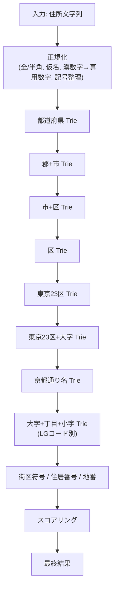

# Strategy（探索戦略）

住所ジオコーディングの核心部分です。入力された住所文字列を段階的に探索し、最適な位置情報（緯度経度）を返します。

## 概要：どうやって住所を見つけるのか

住所「東京都千代田区霞が関1-1-1」を探す場合、以下のステップで処理します：

1. **正規化**: 「東京都千代田区霞が関１ー１ー１」→「東京都千代田区霞が関1-1-1」（全角→半角、漢数字→算用数字）
2. **段階的探索**: 都道府県 → 市区 → 町字 → 番地 の順にトライ木で探索
3. **候補収集**: 各階層でマッチした候補をすべて保持
4. **スコアリング**: 候補の中から最も一致度が高いものを選択

## トライ木とは？

トライ木（Trie）は、文字列を効率的に検索するためのデータ構造です。

### 簡単な例：都道府県の検索

都道府県「東京都」「大阪府」「京都府」をトライ木に格納すると、以下のような木構造になります：

```
       (root)
      /  |  \
     東  大  京
     |   |   |
     京  阪  都
     |   |   |
     都  府  府
     ↓   ↓   ↓
   [東京] [大阪] [京都]
```

**検索の流れ**（「東京都」を探す場合）：

1. ルートから「東」を探す → 見つかった
2. 「東」の子ノードから「京」を探す → 見つかった
3. 「京」の子ノードから「都」を探す → 見つかった
4. 「都」ノードに関連付けられたデータ（緯度経度等）を取得

**メリット**:
- 1文字ずつ辿るので、O(m)（m=文字列長）の高速検索
- 前方一致検索が簡単（「東京」で検索すると「東京都」が見つかる）
- メモリ効率的（共通接頭辞を共有）

### ABR Geocoderでの実装

実際には、各階層（都道府県、市区、町字等）ごとに別々のトライ木を用意しています：

- **PrefTrie**: 都道府県用（「東京都」「大阪府」等）
- **CityTrie**: 市区町村用（「千代田区」「中央区」等）
- **OazaTrie**: 大字・町丁目用（「霞が関」「丸の内」等）
- **RsdtBlkTrie**: 街区符号・住居番号用（「1-1-1」等）

## 処理フローの全体像



## 具体例：「東京都千代田区霞が関1-1-1」の探索

### ステップ1：正規化

入力が「東京都千代田区霞ヶ関１ー１ー１」の場合：

| 処理 | 結果 |
|------|------|
| 元の入力 | `東京都千代田区霞ヶ関１ー１ー１` |
| 全角→半角 | `東京都千代田区霞ヶ関1ー1ー1` |
| 漢数字→算用数字 | `東京都千代田区霞ヶ関1ー1ー1` |
| 記号統一（ー→-） | `東京都千代田区霞ヶ関1-1-1` |
| 異体字統一（ヶ→が） | `東京都千代田区霞が関1-1-1` |

### ステップ2：都道府県の探索（PrefTrie）

入力文字列を先頭から1文字ずつトライ木に照合：

```
入力: 「東京都千代田区霞が関1-1-1」
      ↑
      ここから探索開始

トライ木の探索:
  root → 「東」 → 「京」 → 「都」 → [マッチ！]

結果:
  - 都道府県: 東京都
  - 都道府県コード: 13
  - 残りの文字列: 「千代田区霞が関1-1-1」
```

### ステップ3：市区の探索（CityTrie）

残りの文字列「千代田区霞が関1-1-1」を探索：

```
入力: 「千代田区霞が関1-1-1」
      ↑
      ここから探索開始

トライ木の探索:
  root → 「千」 → 「代」 → 「田」 → 「区」 → [マッチ！]

結果:
  - 市区: 千代田区
  - 市区コード: 13101
  - 残りの文字列: 「霞が関1-1-1」
```

### ステップ4：大字・町丁目の探索（OazaTrie）

残りの文字列「霞が関1-1-1」を探索：

```
入力: 「霞が関1-1-1」
      ↑
      ここから探索開始

トライ木の探索:
  root → 「霞」 → 「が」 → 「関」 → [マッチ！]

結果:
  - 町字: 霞が関
  - 町字コード: 131010012000
  - 残りの文字列: 「1-1-1」
```

### ステップ5：街区符号・住居番号の探索（RsdtBlkTrie）

残りの文字列「1-1-1」を探索：

```
入力: 「1-1-1」
      ↑
      ここから探索開始

トライ木の探索:
  root → 「1」 → 「-」 → 「1」 → 「-」 → 「1」 → [マッチ！]

結果:
  - 街区符号: 1
  - 住居番号: 1
  - 住居番号2: 1
  - 緯度: 35.674176
  - 経度: 139.751774
```

### ステップ6：スコアリング

複数の候補がある場合、以下の基準でスコアリングして最適な結果を選択：

| 項目 | スコア | 説明 |
|------|--------|------|
| マッチレベル | 80点 | 住居番号まで完全一致 |
| 文字一致率 | 100% | 入力文字列の100%が一致 |
| あいまい一致 | 0点減点 | ワイルドカードや補助チャレンジなし |
| 表記差 | 0点減点 | 完全一致（「ヶ」と「が」は正規化済み） |
| **合計** | **180点** | 最高スコア |

## 正規化の詳細

### 全角/半角の統一

```javascript
入力: 「１２３」→「123」
入力: 「ＡＢＣ」→「ABC」
入力: 「　」（全角スペース）→「 」（半角スペース）
```

### 漢数字→算用数字

```javascript
入力: 「一丁目二番三号」→「1丁目2番3号」
入力: 「十五番地」→「15番地」
```

### 異体字・表記ゆれの統一

```javascript
入力: 「霞ヶ関」→「霞が関」
入力: 「竈門」→「竃門」（Unicode正規化）
入力: 「丁目」「町目」→「丁目」
```

### 記号の統一

```javascript
入力: 「1ー1ー1」→「1-1-1」（長音符号をハイフンに）
入力: 「1−1−1」→「1-1-1」（全角ハイフンを半角に）
入力: 「1の1の1」→「1-1-1」
```

## あいまい一致とワイルドカード

完全一致しない場合でも、以下の方法で候補を探します。

### ワイルドカード（`?`）

トライ木のノードに「?」（ワイルドカード）が設定されている場合、任意の1文字にマッチします。

**例**：「霞?関」というパターンで「霞が関」「霞ケ関」「霞ヶ関」すべてにマッチ

```
トライ木:
  霞 → ? → 関
       ↑
       任意の1文字にマッチ

入力「霞が関」: 霞 → が → 関 [マッチ！]
入力「霞ケ関」: 霞 → ケ → 関 [マッチ！]
```

### 補助チャレンジ（extraChallenges）

通常の探索で見つからない場合、以下の代替表記を試します：

| 元の文字 | 補助チャレンジ | 例 |
|---------|--------------|-----|
| が | ケ、ヶ、ガ、カ | 霞が関 → 霞ケ関 |
| の | ノ | 二の丸 → 二ノ丸 |
| 条 | 條 | 四条 → 四條 |
| 崎 | 﨑 | 宮崎 → 宮﨑 |

**スコアへの影響**：補助チャレンジでマッチした場合、スコアが減点されます（完全一致より優先度が低い）

## 部分一致の処理

入力文字列の途中までしか一致しない場合でも、候補として保持します。

**例**：「東京都千代田区霞が関一丁目」を探す場合

1. 「霞が関」までマッチ → 候補1（町字レベル）
2. 「一丁目」が見つからない → 候補1のスコアを調整
3. 最終的に「霞が関」レベルの結果を返却（一丁目は無視）

**スコアへの影響**：文字一致率が下がるため、スコアは減点されます

## スコアリングの詳細

### マッチレベルによる基本点

| マッチレベル | 基本点 | 説明 |
|------------|--------|------|
| 住居番号まで完全一致 | 80点 | 「霞が関1-1-1」まで完全一致 |
| 街区符号まで一致 | 70点 | 「霞が関1-1」まで一致 |
| 町字まで一致 | 60点 | 「霞が関」まで一致 |
| 市区まで一致 | 40点 | 「千代田区」まで一致 |
| 都道府県まで一致 | 20点 | 「東京都」まで一致 |

### 文字一致率による加点

```
文字一致率 = (マッチした文字数) / (入力文字列の総文字数) × 100

例：「東京都千代田区霞が関1-1-1」(15文字) が完全一致
  → 文字一致率 = 15 / 15 × 100 = 100%
  → 加点: +20点

例：「東京都千代田区霞が関」(11文字) のみ一致、「1-1-1」が不一致
  → 文字一致率 = 11 / 15 × 100 = 73%
  → 加点: +15点（減点）
```

### あいまい一致による減点

| あいまい一致の種類 | 減点 |
|------------------|-----|
| ワイルドカード（?）でマッチ | -5点/箇所 |
| 補助チャレンジでマッチ | -10点/箇所 |

### 最終スコア計算例

**入力**：「東京都千代田区霞ヶ関1-1-1」（「ヶ」が異なる）

| 項目 | 点数 | 説明 |
|------|------|------|
| マッチレベル | 80点 | 住居番号まで一致 |
| 文字一致率 | +20点 | 100%一致 |
| あいまい一致 | -10点 | 「ヶ」→「が」の補助チャレンジ |
| **合計** | **90点** | 良いマッチング |

## 複数候補がある場合

同じ文字列に複数の解釈がある場合、すべての候補を探索してスコアリングします。

**例**：「中央区」は複数存在

1. 東京都中央区
2. 大阪府大阪市中央区
3. 神戸市中央区
4. ...（他多数）

**処理**：
1. すべての「中央区」を候補として取得
2. 入力文字列の残り部分と照合して、それぞれスコアリング
3. 最高スコアの候補を返却

**ヒント**：より詳細な住所（「東京都中央区」）を入力すると、スコアが高くなり正確な結果が得られます

## 探索のキーポイント

### 1. 再帰的な探索

トライ木の探索は再帰的に実行されます：

```typescript
function find(node, inputChars, index) {
  if (index >= inputChars.length) {
    return node.data; // 文字列の終端に到達
  }

  const char = inputChars[index];

  // 1. 完全一致を探す
  const exactMatch = node.findChild(char);
  if (exactMatch) {
    return find(exactMatch, inputChars, index + 1);
  }

  // 2. ワイルドカードを探す
  const wildcardMatch = node.findChild('?');
  if (wildcardMatch) {
    return find(wildcardMatch, inputChars, index + 1);
  }

  // 3. 補助チャレンジを試す
  for (const altChar of getAlternatives(char)) {
    const altMatch = node.findChild(altChar);
    if (altMatch) {
      return find(altMatch, inputChars, index + 1);
    }
  }

  return null; // 見つからない
}
```

### 2. 中間ノードでのデータ収集

トライ木の途中のノードにもデータが格納されている場合があります。

**例**：「霞が関」と「霞が関一丁目」が両方存在する場合

```
トライ木:
  霞 → が → 関 → [データ1: 霞が関]
              ↓
              一 → 丁 → 目 → [データ2: 霞が関一丁目]
```

探索中、「関」ノードでデータ1を収集し、さらに「目」ノードでデータ2も収集します。最終的に両方をスコアリングして最適な結果を選びます。

### 3. ハッシュ連結リストによる重複排除

同じキーに複数の値がある場合、ハッシュ連結リストで管理します。

**例**：「中央区1-1-1」が複数の都市に存在

```
「1-1-1」ノード
  ↓
[ハッシュ連結リスト]
  → 東京都中央区1-1-1（緯度経度A）
  → 大阪市中央区1-1-1（緯度経度B）
  → 神戸市中央区1-1-1（緯度経度C）
```

すべての候補を取得し、上位階層（市区町村等）の情報と照合してスコアリングします。

## パフォーマンスの秘密

### O(m)の探索時間

文字列の長さを m とすると、トライ木の探索は O(m) で完了します。

- データベースのLIKE検索: O(n)（n=レコード数）
- ハッシュマップ: O(m)（キーのハッシュ計算）
- **トライ木**: O(m)（1文字ずつ辿るだけ）

### メモリ共有による高速化

SharedArrayBufferを使い、ワーカースレッド間でトライ木データを共有：

- **メモリコピー不要**: Workerに送る際のシリアライゼーションが不要
- **並列検索**: 複数のWorkerが同時に同じトライ木を参照可能
- **キャッシュ効率**: CPUキャッシュに乗りやすいバイナリ形式

### バッファベースの読み取り

ファイルI/Oを行わず、メモリ上のBufferから直接ノードを読み取り：

```typescript
// オフセット位置からノードを読み取り
const nodeSize = buffer.readUInt8(offset);
const siblingOffset = buffer.readUInt32BE(offset + 1);
const childOffset = buffer.readUInt32BE(offset + 5);
const hashListHead = buffer.readUInt32BE(offset + 9);
const name = buffer.toString('utf8', offset + 13, offset + nodeSize);
```

## コントリビューションのヒント

### 探索アルゴリズムの改善

- **枝刈り最適化**: スコアが低い候補を早期に除外
- **キャッシング**: 頻繁に検索される住所をキャッシュ
- **並列探索**: 複数のトライ木を並列に探索

### 正規化ルールの追加

- **新しい表記ゆれ**: 地域固有の表記ゆれに対応
- **略称対応**: 「都庁」→「東京都庁」等の展開
- **誤字訂正**: Levenshtein距離による編集距離計算

### スコアリングの改善

- **機械学習**: 過去の検索結果からスコアリングモデルを学習
- **文脈考慮**: 前後の文脈から最適な候補を選択
- **ユーザーフィードバック**: 選択された結果を学習に反映

この探索戦略により、ABR Geocoderは高速かつ柔軟な住所ジオコーディングを実現しています！
