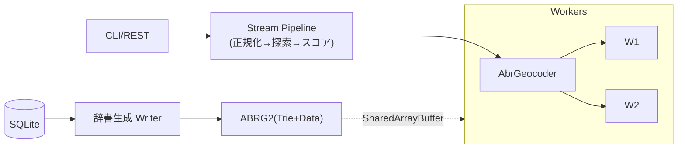

# ABR Geocoder v2.2 内部仕様

このドキュメントは、ABR Geocoder の内部アーキテクチャ、設計思想、並列処理、そして SQLite を起点に生成されるキャッシュ（ABRG2 バイナリ辞書）の仕様をまとめたものです。公開前提の日本語ドキュメントで、Mermaid 図で構造を可視化しています。Node.jsについて、ある程度分かる方を想定しています。

## これは何？（ひとことで）

- 「住所 → 緯度経度」を高速に引くための、Node.js 製ジオコーダです。
- コアは「トライ木（Trie）で検索」「辞書（ABRG2）をバイナリで持ち、Bufferで直接読む」仕組みです。
- 検索はストリーム変換のパイプライン、並列化は worker_threads、共有は SharedArrayBuffer で行います。

## Node.js の用語でざっくり全体像

- Buffer/TypedArray: ABRG2 は Big Endian の整数＋UTF-8 文字列で直に詰めたバイナリ。Finder は Buffer をコピーせず read します。
- Stream: 住所正規化→段階的探索→スコアリングは Transform をつないだパイプラインです。
- worker_threads: 複数のワーカーに入力を投げ、SharedArrayBuffer で辞書を共有。結果は入力順に戻すための連結リストで整列します。
- DI: DB 接続やキャッシュパスなどはコンテナから注入（UseCase に if 分岐を持ち込まない）。

## まず押さえておくと楽になるポイント

- Trie は「文字列を1文字ずつ辿る木」。共通接頭辞を共有でき、前方一致や部分一致に強い。
- ABRG2 は Trie ノード（子/兄弟/値リスト+1文字）＋ Data ノード（gzip(JSON)＋ハッシュ）の連結。Finder は Buffer から直接 decode。
- あいまい検索は、正規化後の比較用文字（`char`）と元の文字（`originalChar`）を CharNode が両持ち、分岐時は `.clone()`。
- 並列化は「ワーカーに投げる」だけでなく、「入力順に結果を返す」ための整列（連結リスト）がカギ。

## 何が作れる？（拡張の方向性）

- 住所の新しい分解ルールや置換（正規化）を Transform として追加
- 新しい辞書（Trie）の追加：Writer で生成、Finder を継承
- API 拡張：フォーマッタ追加、CLI サーバ連携

## 読み進め方（おすすめ順）

1) Architecture: 全体像と Clean Architecture/DI の理由
2) Geocoding → Strategy/あいまい検索/Parallelism: 住所探索の流れと並列・整列の考え方
3) Geocoding → ABRG2 Format/Finder Internals: 辞書の中身と検索の仕組み
4) Classes/Utilities: 主要クラス・表記変換の詳細（kan2num など）
5) Operations/Troubleshooting: 運用とハマりどころ

時間がない方向けの最短ルート：

- Geocoding/Strategy → Geocoding/あいまい検索 → Geocoding/Parallelism → Geocoding/ABRG2 Format

## 便利な対応表（知っていると読みやすい）

- 「バイナリ辞書」= JSON を安定化（json-stable-stringify）して gzip → FNV-1a 64 でキー付け → 連結ノードに保存
- 「Trie の値リスト」= データノードへのオフセットの連結リスト
- 「SharedArrayBuffer」= Finder 側で Buffer を共有、コピーが発生しない
- 「整列」= Worker の結果を入力順に返すための連結リスト（WorkerPoolTaskInfo）

