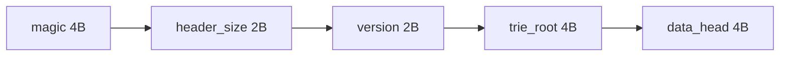

# バイナリファイルの基礎

このプロジェクトの辞書（ABRG2）は、Node.js の `Buffer` を使って Big Endian で読み書きします。ファイル内のアドレス（オフセット）を数値で指し示し、ノード同士をつなぎます。

## ヘッダーの読み方

- 先頭4バイト: マジック `"abrg"`
- 次の2バイト: ヘッダーサイズ `u16`
- 次の2バイト: バージョン `u8,u8`
- 次の4バイト: Trie のエントリポイント `u32`
- 次の4バイト: Data のエントリポイント `u32`



Node.js での読書き（抜粋）:

```ts
const buf = Buffer.alloc(4);
buf.writeUInt32BE(0x01020304, 0); // Big Endian で u32 を書く
const value = buf.readUInt32BE(0);
```

## ノードの構成

Trie ノード:

- `size(u8)` → ノード全体の長さ
- `sibling(u32)` → 兄弟ノードの先頭オフセット（0なら未設定）
- `child(u32)` → 子ノードの先頭オフセット
- `hash_list(u32)` → 値リストの先頭
- `name(utf8)` → 1文字ぶん（UTF-8, 可変長）

可変長の `name` があるため、先頭の `size` を読んでから残りを解釈します。

データノード（値）:

- `next(u32)` → 次のデータノード（同一ハッシュ連結）
- `size(u16)` → このノード全体のサイズ
- `hash(u64)` → 圧縮後データの FNV-1a 64bit ハッシュ
- `data(bytes)` → `gzip(JSON)` の実データ

## 実装時の注意

- すべて Big Endian 系の API（`readUInt32BE`, `writeUInt32BE` 等）を使う
- オフセット演算を間違えると復元不能になるので、`size` を基準に安全に移動する
- UTF-8 は可変長。必ず `size` で区切る

