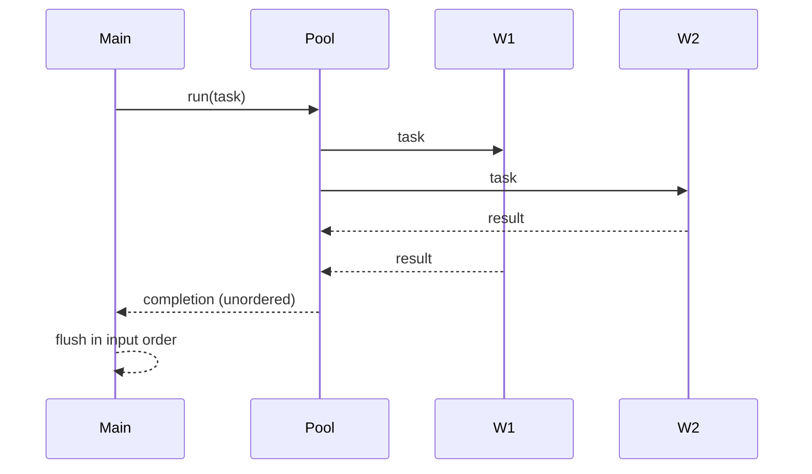

# 並列処理とWorker

## Worker Threads の基本

- Node.js の `worker_threads` で別スレッドを起動し、メッセージでやり取りします
- 大きな辞書バッファは `SharedArrayBuffer` で共有し、コピーを避けます

## 順序の保持

- 入力順で結果を返すため、`WorkerPoolTaskInfo` を連結リストとして管理
- 完了通知は順不同でも、`flushResults()` で先頭から順に emit

## 簡易セマフォ（書き込み時のみ）

- キャッシュ生成（書き込み）では `SemaphoreManager` が共有配列に `Atomics` で排他制御
- 検索（読み出し）はロック不要（参照専用）

## 実用上の注意

- 共有メモリはプロセスのメモリを消費します。サイズに上限を設け、必要な辞書のみ共有する設計が重要です

