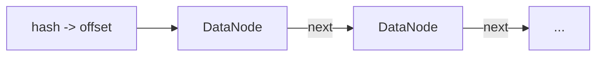

# ハッシュと重複排除

同じ値（JSON行）が何度も出現すると、ファイルサイズが膨らみます。そこで、値を `gzip` したバイト列に対して 64bit の FNV-1a ハッシュを計算し、同一ハッシュの値は連結リストで束ねます。完全一致なら追記せず再利用します。

## なぜ圧縮後にハッシュ？

- JSON はキー順などでバイト列が揺れやすい。`json-stable-stringify` で安定化し、さらに `gzip` で圧縮した結果にハッシュを取ると、重複検出の精度が上がります

## FNV-1a 64（抜粋）

```ts
function fnv1a64(data: Buffer): bigint {
  let hash = 0xcbf29ce484222325n;
  const prime = 0x00000100000001b3n;
  for (const byte of data) {
    hash ^= BigInt(byte);
    hash = (hash * prime) & 0xffffffffffffffffn;
  }
  return hash;
}
```

## 連結と検証

1) ハッシュが既知なら、そのハッシュの先頭データノードから `next` を辿る
2) 各ノードの `data` を取り出し、`Buffer.compare()` で完全一致を確認
3) 一致が見つかれば再利用。なければ連結末尾に新規ノードを追加



読み出し側は、期待ハッシュを渡して `readDataNode(offset, expectHash)` を呼ぶことで、衝突時も同一ハッシュのみ辿る最適化が可能です。

