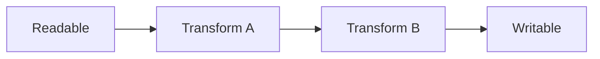
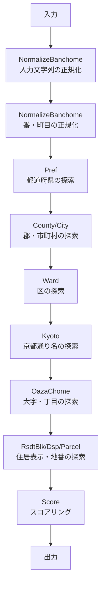

# ストリームと Buffer

このページは「Node.js に詳しくないが本ソフトを使いたい」方向けに、できるだけ平易にストリームと Buffer を説明します。

## そもそもストリームとは

- 「データを少しずつ（チャンク単位で）順に流す仕組み」です。
- 一度に全データを読み込まず、到着した分だけ処理するので、メモリ効率が良く、大量データでもスムーズに処理できます。
- 役割ごとに以下の4種類があります。
  - Readable: 読み出せる側（データの出どころ）
  - Writable: 書き込める側（データの行き先）
  - Transform: 入力を受けて変換して出力（中間フィルタ）
  - Duplex: 読み書き両方（双方向）



現実での例え: ホース（Readable）から水が出て、フィルタ（Transform）を何段か通って、貯水タンク（Writable）にたまるイメージです。

### なぜ使うのか（利点）
- メモリ節約: 1行/1件ずつ処理できる
- 速度: I/O と処理を重ねられる（流しながら処理）
- 構成が明快: 機能ごとに Transform を足していける

## まず動く最小コード

```ts
import { Readable, Transform, Writable } from 'node:stream'

// 1) データ源（配列から行を読み出す）
const src = Readable.from(['tokyo', 'osaka', 'kyoto'], { objectMode: true })

// 2) 変換（大文字化）
class Upper extends Transform {
  constructor(){ super({ objectMode: true }) }
  _transform(chunk: string, _enc, cb){ this.push(chunk.toUpperCase()); cb() }
}

// 3) 行き先（コンソール出力）
const dst = new Writable({
  objectMode: true,
  write(chunk, _enc, cb){ console.log(chunk); cb() }
})

src.pipe(new Upper()).pipe(dst)
```

ポイント:
- `objectMode: true` は「文字列やオブジェクトを1件ずつ扱う」設定（バイト列ではなくレコード志向）
- `pipe()` でつなぐと、`Readable → Transform → Writable` の順に流れます
- エラーは `.on('error')` で拾えます

## バックプレッシャ（詰まり対策）

ストリームは「早すぎると待つ」仕組みを持ちます。書き込み先が遅いと、上流に「待って」と合図が返ります（内部でハイウォーターマークを超えると `write()` が false を返し、`drain` で再開）。

実際の対処は通常 `pipe()` がよしなにやるので、手で制御する場面は多くありません。本ソフトでは、ワーカープール側で同時タスク数を絞って、全体の流量を安定させています。

## このソフトでの使い所

- 住所処理は Transform を積み重ねたパイプラインです（正規化 → 丁目・通り名など段階的探索 → スコアリング）。
- 大量の入力でも 1件ずつ流し、最終結果だけを書き出します。



## Buffer とは（バイナリの箱）

- `Buffer` は「バイナリ（生のバイト配列）」を表すオブジェクトです。
- 文字列はエンコード（`utf8`, `ascii` など）を経由してバイト列になります。
- 数値をバイト列にする/バイト列から数値を読むときは、エンディアン（ビッグ/リトル）を意識します。

例（ビッグエンディアンで整数を書き/読む）:

```ts
const buf = Buffer.alloc(4)
buf.writeUInt32BE(0x01020304, 0) // 4バイトの数値を書き込む
const n = buf.readUInt32BE(0)     // => 16909060 (0x01020304)
```

このソフトでは、辞書ファイル（ABRG2）を Buffer で読み、`readUInt8/16/32BE`, `readBigUInt64BE` などで数値や文字列を復元しています。ワーカーには `SharedArrayBuffer` として共有するため、巨大な辞書でもコピーせずに検索できます。

## 典型的な落とし穴とコツ

- objectMode の混在: バイト列のストリームとオブジェクトのストリームは別物。混ぜる場合は変換点を明確に
- Transform のコールバック忘れ: `cb()` を呼ばないと流れが止まります
- エラー処理: どこかで `.on('error')` を付けるか、`pipeline()`（promises）でまとめて扱う
- 文字化け: 文字列⇔Buffer でエンコード指定をミスらない（`utf8` が基本）

## 本ソフトの実装にひも付け

- Geocode パイプラインは `GeocodeTransform` が構築（複数の Transform を `pipe` で接続）
- バイナリ辞書は `TrieAddressFinder2` が Buffer を直接読み込み（I/Oレスで高速）
- 共有メモリ（`toSharedMemory`/`fromSharedMemory`）でワーカースレッドに配布し、コピーを避けます
