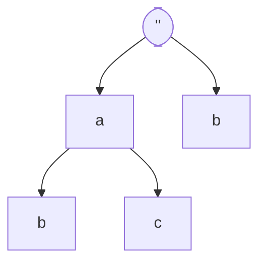
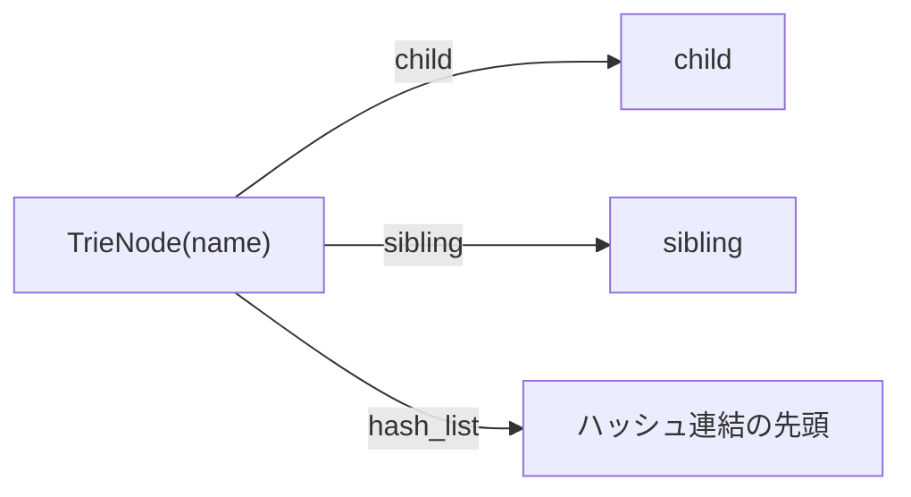

# Trie と探索の考え方

## なぜ Trie なのか

住所のように「文字列の先頭から共通部分が長い」データは、キーを1文字ずつ辿る Trie（トライ木）で効率よく表現できます。共通接頭辞を共有できるため、単純な連想配列の羅列よりメモリ効率に優れ、前方一致検索も自然に行えます。



このプロジェクトでは、各ノードが「兄弟(sibling)」「子(child)」「値への参照リスト(hash_list)」を持ち、ノード名は「その位置の1文字」です。



## どうやって検索するか

1) 入力文字列を正規化（全/半角・仮名・漢数字など）
2) ルートから target の先頭1文字とノード名を比較
   - 等しい → 子へ
   - 異なる → 兄弟へ
   - `fuzzy`（ワイルドカード）が指定されていて target が `?` の場合は、兄弟へ分岐する探索も追加
3) 途中のノードに値（=ハッシュ連結リスト）があれば部分一致候補として記録
4) 末尾 or 子がないところで候補を確定し、最後にスコアリングで最良の候補を選ぶ

擬似コード（概略）:

```text
queue = [{ node: root, i: -1, path: "" }]
while queue not empty:
  task = queue.pop()
  node = readTrieNode(task.node)
  if mismatch(target[i+1], node.name):
    if node.sibling: queue.push({node: node.sibling, i: task.i, path: task.path})
    if fuzzy:        queue.push(… ワイルドカード分岐 …)
    continue

  if node.hash_list: keep as partial match
  if end-of-target or !node.child: finalize candidate
  else queue.push({node: node.child, i: task.i+1, path: task.path + node.name})
```

## 計算量の直感

- 挿入/探索は概ね O(|key|)。兄弟の横移動が多い場合はその分だけ増える
- 値の重複はデータノードの再利用（重複排除）で節約

## よくある疑問

- 連想配列（オブジェクト/Map）ではダメ？
  - 前方一致系や「途中までの一致」を多用するので、Trie のほうが自然。共通接頭辞の共有でメモリ効率も良い
- マルチバイト文字は？
  - ノード名は UTF-8 で可変長ですが、ノード先頭の `size` で全体長を把握し安全に復元します

