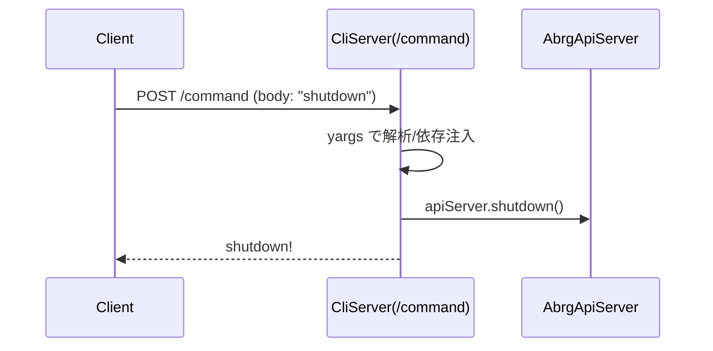

# CLI Server

CLIサーバーは、HTTP経由で「CLI相当のコマンド」を受け付けられる薄いラッパーです。サーバー・プロセスを外部から制御したい運用（例: コンテナ内の優雅な停止）に向きます。

## 目的と位置づけ

- REST API（`/geocode`）は検索用、CLIサーバー（`/command`）は制御用
- yargs を使って受け取った文字列をコマンドとして解釈し、必要な依存（`AbrgApiServer`, `CliServer` など）を注入して実行
- CORSはワイドオープン（任意オリジン許可）

## エンドポイント

- `POST /command`
  - Body: プレーンテキスト（例: `shutdown`）
  - 成功時: 200 OK とメッセージ
  - 失敗時: 500 エラーメッセージ

CORS/ヘッダーは `CliServer` 内で設定（`Access-Control-Allow-Origin: *` など）。

## 実装の要点

- 入口: `src/interface/cli-server/index.ts`
  - `CliServer` は `hyper-express` の `Server` を継承
  - ルーター `/command` で `OnCommandRequest.run()` を呼び出す
- ハンドラー: `src/interface/cli-server/on-command-request.ts`
  - `request.text()` をそのまま yargs に渡し、パース（空白区切り）
  - `middleware` で以下を注入
    - `apiServer`（`AbrgApiServer` インスタンス）
    - `cliServer`（`CliServer` 自身）
    - `request`, `response`（`hyper-express`）
  - 定義済みコマンドを登録（現状: `shutdown`）
- コマンド: `src/interface/cli-server/commands/shutdown.ts`
  - `shutdown` 実行で、`response.send('shutdown!')` の後
  - `apiServer.shutdown()` → `cliServer.shutdown()` の順に停止

## 使い方（例）

- ローカルから停止
  - `curl -X POST http://localhost:PORT/command --data "shutdown"`
- 任意の独自コマンドを足す場合
  1) `src/interface/cli-server/commands` に `foo.ts` を追加
  2) `OnCommandRequest` 内の `.command(FooCommand)` に登録
  3) `handler(argv)` に処理を実装（`extras` に注入される `apiServer/cliServer/response` などが使えます）

## セキュリティ/運用上の注意

- コマンドの実行は強力です。公開環境では必ずネットワーク境界/認証のレイヤで制限してください
- CORS はオープン設定のため、イントラネット用途やリバースプロキシでの制限を推奨
- `shutdown` は即座にサーバーを停止させるため、ヘルスチェック/グレースフルシャットダウン戦略と合わせて利用してください

