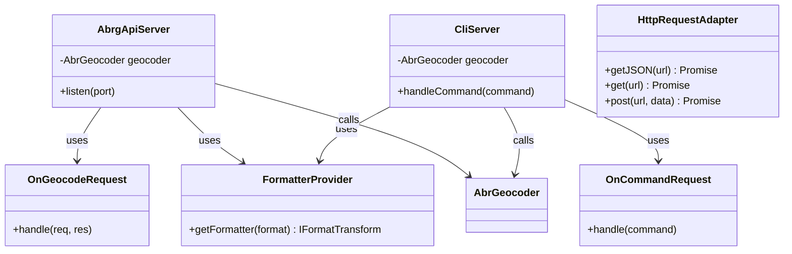

# REST API Overview

エンドポイント（既定）:

- `GET /geocode?address=<文字列>&target=<ALL|RESIDENTIAL|PARCEL>&fuzzy=?&format=<json|ndjson|geojson|csv>`

処理の流れ:

1) `OnGeocodeRequest` がクエリを検証（`address` 必須, `fuzzy` は1文字, target/format はホワイトリスト）
2) フォーマッタを生成（`FormatterProvider`）し、結果をストリームに流す
3) `AbrGeocoder.geocode()` を1件呼び出し、最終結果を整形

CORS: すべての GET を許可（`hyper-express` のミドルウェアで設定）

CLI サーバ（/command）:

- `CliServer` は `/command` を POST で受け付け、CLI 操作をプロセス外から委譲できる

## API/CLI Layer（インターフェース層）

REST APIとCLIのエントリポイントです。

**役割:**
- **AbrgApiServer**: HTTP APIサーバー。RESTful APIでジオコーディングリクエストを受け付け
- **CliServer**: CLIコマンド処理用サーバー
- **OnGeocodeRequest**: ジオコードAPIリクエストハンドラー
- **OnCommandRequest**: CLIコマンドリクエストハンドラー
- **FormatterProvider**: 出力フォーマッター（CSV, JSON, GeoJSON等）を提供
- **HttpRequestAdapter**: HTTP通信の抽象化レイヤー
