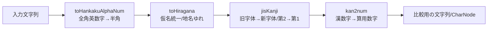
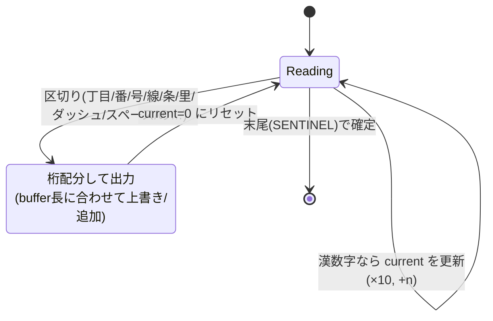
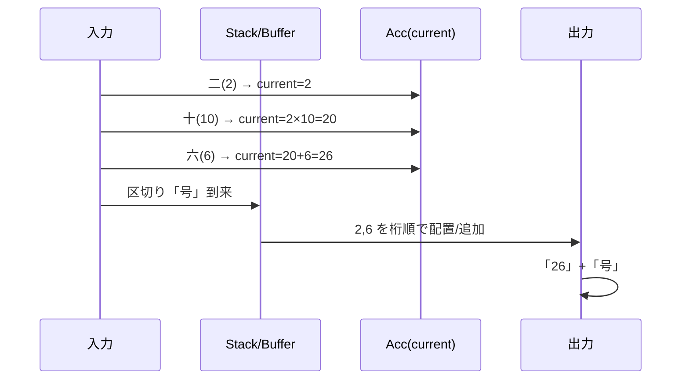
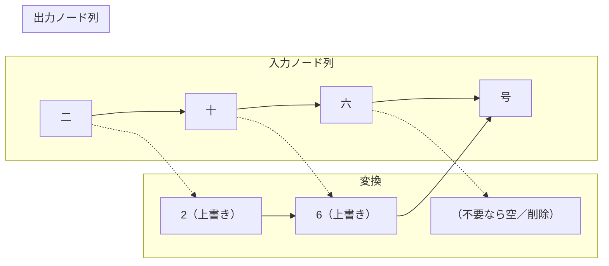

# Utilities（抜粋）

- `reg-exp-ex.ts` 正規表現ユーティリティ（タグ式置換、命名グループ対応の使い勝手改善）
- `crc32-lib.ts` CRC32（ファイル/バッファ/文字列/レコード）
- `make-dir-if-not-exists.ts` フォルダ作成
- `remove-files.ts` パターン指定の削除（古いキャッシュ掃除）
- `resolve-home.ts` `~` 展開
- `thread/semaphore-manager.ts` 簡易セマフォ（Writer 内での排他）
- `thread/shared-memory.ts` Buffer と SharedArrayBuffer の変換
- `logger/debug-logger.ts` デバッグ出力（`debug` モードのみ）
- `transformations/*` 行/コメントフィルタやカウンタなどストリーム補助

## 表記変換（ジオコーディング前処理）

住所の表記ゆれを吸収するため、以下の順序で正規化します（実装の流れの一例）。

1) 半角英数字への統一: `toHankakuAlphaNum`
2) 仮名の統一（片/半角→ひらがな等）: `toHiragana`
3) 旧字体/第2水準→新字体/第1水準: `jisKanji`
4) 漢数字→算用数字: `kan2num`

それぞれの関数は `string` と `CharNode`（ノード連結）の両方に対応します。`CharNode` 版では `originalChar` を保持したまま `char` を置換し、必要に応じて `ignore` を使って後段処理に影響を与えないように調整します。

### toHankakuAlphaNum（全角英数字→半角）

- 目的: 全角の英字/数字を半角へ置換（記号は対象外）
- 実装: マップ置換（例: `Ａ→A`, `１→1`）。`CharNode` 版は各ノードの `char` をその場で置換
- 計算量: O(n)（n=文字数）
- 例:
  - `ＡＢＣ１２３` → `ABC123`

### toHiragana（仮名をひらがな系へ統一 + 特殊表記）

- 目的: 片仮名/半角片仮名などをひらがなへ統一。地名の表記慣習に合わせた特別扱いあり
- 特徴:
  - `String.normalize('NFKC')`で濁音付き半角カナを正規化した上で、詳細マップで置換
  - 「龍ケ崎/霞ヶ関」のような「ケ/ヶ/ガ」ゆれを地名整合のために「け」へ寄せる等、地名固有の表記揺れに対処
  - `CharNode` 版は `ignore === true` のノードは変換しない（後段の整合維持が目的）
- 計算量: O(n)
- 例:
  - `ｶﾞｯｺｳ` → `がっこう`
  - `霞ヶ関`/`霞が関`/`霞ケ関` → `霞け関`（内部比較用の統一）

### jisKanji（旧字体/第2水準→新字体/第1水準）

- 目的: 旧字体やJIS第2水準の漢字を、検索キーと一致しやすい新字体/第1水準に統一
- 実装の要点:
  - 古→新の置換テーブルを `TrieAddressFinder` に投入し、最長一致で変換（1文字以上の置換に対応）
  - `CharNode` 版では一致長に合わせて新文字列へ展開。展開しきれない分は `ignore: true` を立てて桁合わせ
- 計算量: O(n·α)（αは平均マッチ長）
- 例:
  - `川﨑` → `川崎`
  - `澤` → `沢`、`舊` → `旧`

### kan2num（漢数字→算用数字、Monotonic Stack）

- 目的: 住所に含まれる漢数字（例: `十二`, `三十八`）を算用数字へ変換し、`丁目/番/号/線/条` などの単位表記に柔軟に対応
- 変換対象の区切り: `軒/通/丁/町/字/番/部/所/社/線/号/条/里`、ダッシュ・スペース、「の/之/ノ/丿」などに遭遇したら直前の数値塊を確定
- コアアイデア（Monotonic Stack + アキュムレータ）:
  - 走査しつつ「数値候補」をスタック/バッファに溜め、非数値の区切りでまとめて数値にする
  - 単位（`十`=10）に遭遇したときは「掛け算→加算」の順で更新（`二十`→2×10、次に`三`が来れば`20+3`）
  - 例: `二十五` → (2×10)+5 = 25、`一〇一` → (((1×10)+0)×10)+1 = 101
  - `CharNode` 版は元のノード列（buffer）に対して、確定した数値の各桁を左から順に上書き/追加して整形（`originalChar`は保持）
- 擬似コード（概念）:

```text
current = 0; lastWasTen = false; buffer=[]; result=[]
for ch of input + SENTINEL:
  if isKanjiDigit(ch):
    v = value(ch)
    if v == 10:              // 十
      current = (current==0) ? 10 : current*10
      lastWasTen = true
    else:
      current = lastWasTen ? current + v : current*10 + v
      lastWasTen = false
    buffer.push(ch)
  else: // 区切り到来
    if current>0:
      emit digits(current) into result, aligned to buffer length
    flush buffer/current/flags
    result.push(ch)
```

- 計算量: O(n)
- 例:
  - `東十二丁目` → `東12丁目`
  - `西六線北二十六号` → `西6線北26号`
  - `九十九里町` → `99里町`

注意:
- `kan2num` は「区切り候補」に依存して数値塊を確定するため、文脈による意図せぬ変換を避けやすい設計です
- ただし特殊な地名で漢数字が意味を持つケースは変換しないこともありえます（テーブル/区切りの調整で改善）

## 簡易図（正規化フローと kan2num の概念図）

### 全体の正規化パイプライン



### kan2num の流れ（概念）



### ステップ例:「二十六号」



### CharNode 版の置換イメージ


